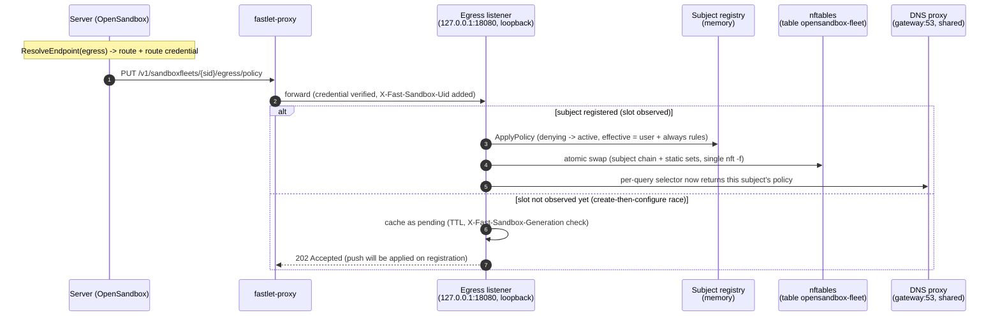
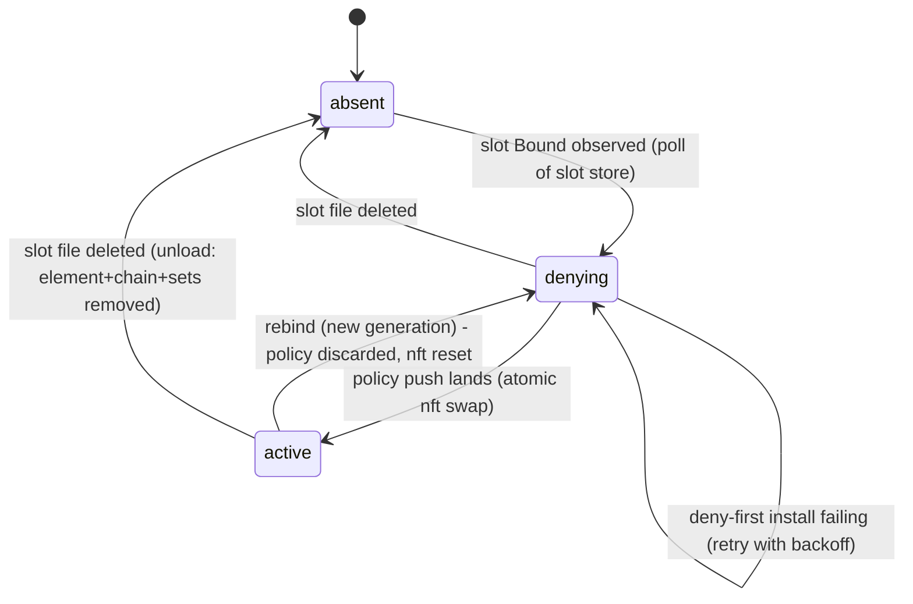
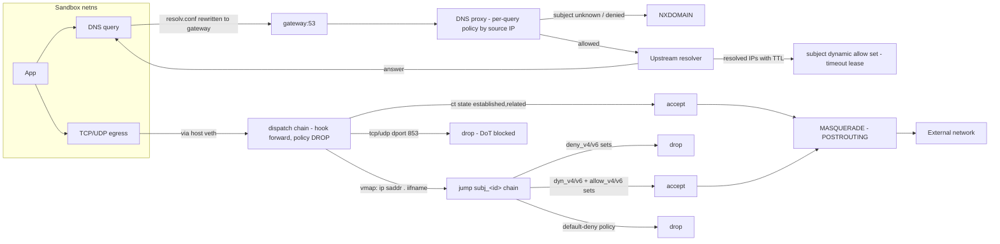
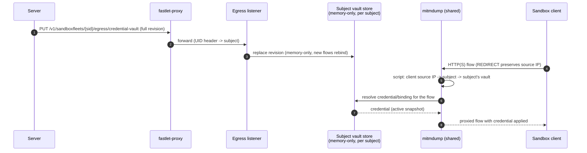

# Egress Policy, Traffic Flow, and Credential Vault (Fleet Profile)

This document shows how a sandbox's outbound network policy, its traffic flow,
and the credential vault work in the **fleet profile**: one egress
control plane serving N sandboxes that share one host/network domain
(fast-sandbox Fastlet Pod). Each sandbox is a **subject** with its own policy,
kernel rules, and credentials.

The sidecar profile differs (single policy, `hook output`, iptables DNS
REDIRECT on 15353); only the fleet model is drawn here.

## 1. Control plane: policy and credential push

The server pushes policy and vault revisions over fast-sandbox's own proxy
route. The egress listener binds the Pod netns loopback only — fastlet-proxy
is the only peer and injects `X-Fast-Sandbox-Uid` to route the push to a
subject. There is no sandbox-reachable policy surface.

## 2. Subject lifecycle: deny-first → active

A subject is fail-closed from the moment its slot is observed until its own
policy lands. Registration installs deny-first rules (empty sets, drop chain,
resolv.conf → gateway) before the policy push can arrive.

Recovery after egress restart: `ApplyReset` wipes the table, the watch
re-delivers every bound slot (all subjects re-enter `denying`), and the
server's reconciliation re-pushes policies.

## 3. Data plane: outbound traffic flow

Two enforcement layers per sandbox: the authoritative Pod netns `forward`
hook (below), plus a per-sandbox netns OUTPUT chain mirroring the same policy
as defense in depth (`nsenter` from the host, table `opensandbox-fleet-ns`).
The sandbox layer allows loopback, DNS to the slot gateway only (dport 53,
gateway-scoped — the Pod layer enforces DNS policy via the proxy), and the
mirrored deny/dyn/allow verdicts; it catches traffic the forward hook never
sees (sandbox → host-local destinations take the INPUT path). DNS-learned
leases are refreshed in lockstep between both layers by the per-subject
connection refresh loop (Pod netns conntrack, bucketed by source IP, one
batched transaction per tick). Only TCP sessions are renewed — UDP/QUIC
(HTTP/3) relies on DNS lease TTLs; a sandbox-layer mirror miss marks the IPs
pending and redelivers them on the next tick.

Dispatch is a verdict map keyed by
`ip saddr . iifname` (the host veth binding is defense in depth against UDP
spoofing); the master chain defaults to **drop** so unregistered sources are
denied before their slot is even observed.

## 4. Credential vault

> Status: the **control plane** below (revision push + per-subject in-memory
> store) is implemented. The **data plane** (shared mitmdump, REDIRECT with
> preserved source IP, subject-aware active API, addon wiring) is **design
> only — not yet implemented**. The diagram shows the target shape.

Vault revisions are pushed over the proxy route and held **memory-only** per
subject (OSEP-0012 model — no Secret volume, nothing written to egress disk).
The shared mitmdump instance selects the subject's vault by the client's
source IP (transparent REDIRECT preserves it); a rebind swaps the revision in
memory and new flows pick up the new credentials.

Missing pieces for the data plane (all subject-aware extensions of the
sidecar's single-vault mechanism — `mitmscripts/system.py` + the `/_active`
unix socket):

- shared mitmdump startup in the fleet assembly, and the per-sandbox netns
  OUTPUT REDIRECT pairs installed from the host (`nsenter`), see
  [fleet-mitm-data-plane.md](fleet-mitm-data-plane.md)
- subject dispatch inside the shared active socket: `/_active?clientIp=…`
  → `registry.Resolve` → subject vault snapshot (one socket, no per-subject
  sockets, no UID in the socket protocol)
- addon wiring: `flow.client.peername[0]` -> active socket -> vault

## 5. Fail-closed invariants

| Transition / event | Guarantee |
|---|---|
| Slot observed, no policy yet | deny-first: empty nft sets + drop chain, resolv.conf → gateway, DNS NXDOMAIN |
| Policy push before slot | cached pending (TTL); applied on registration; generation mismatch discards it |
| Policy push lands | one atomic `nft -f` transaction (chain + static sets); DNS selector switches per subject |
| Rebind (new generation) | policy discarded in registry AND nft chain/sets/DNS leases force-reset |
| Unload (slot deleted) | dispatch element + chain + all sets removed in one transaction |
| Egress restart | stale rules wiped (ApplyReset), all subjects re-enter denying, server re-pushes |
| Unregistered source | master chain policy drop — denied before the slot is ever observed |
| Unparseable slot record | fail closed (event error logged, subject never activated) |

## Component map

| Concern | Implementation |
|---|---|
| Subject state machine | `pkg/subject` (`MemoryRegistry`, `Controller`) |
| Slot store (identity) | `pkg/slotsource` (`FileParser`, polling `FileSource`) |
| Per-subject nft rules | `pkg/fleetnft` (verdict-map dispatch, atomic swap, reset) |
| Policy/vault HTTP surface | `fleet_server.go` (UID routing, pending cache, per-subject vault) |
| DNS per-query dispatch | `pkg/dnsproxy` `SetQueryPolicySelector` |
| resolv.conf rewrite | `pkg/resolvrewrite` |
