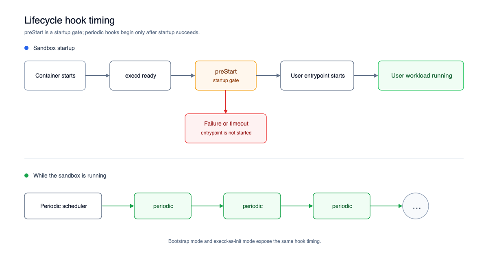

# Lifecycle Hooks

Lifecycle hooks let a sandbox run declarative commands at defined points in its runtime. OpenSandbox currently supports a blocking `preStart` hook and one or more non-blocking `periodic` hooks.

## Supported hooks

| Hook | Cardinality | When it runs | Failure behavior |
|---|---:|---|---|
| `preStart` | Zero or one | After execd starts listening, before the user entrypoint starts | A failure or timeout prevents the user entrypoint from starting |
| `periodic` | Zero or more | The scheduler starts after `preStart` succeeds and runs each hook on its schedule | A failed or timed-out run is logged and later runs normally continue; if a timed-out process cannot be terminated, that hook is disabled |

Both hooks run inside the sandbox with the sandbox environment. Commands are argument arrays and are executed directly. To use shell syntax such as pipes, redirects, or variable expansion, invoke a shell explicitly, for example `['sh', '-c', 'command > file']`.



The ordering is the same in both startup modes:

1. execd starts and its HTTP server begins listening.
2. `preStart` runs to completion, if configured.
3. The periodic scheduler starts, if configured.
4. The user entrypoint starts.

In execd-as-init mode, execd remains PID 1 and starts the entrypoint as its supervised child. In bootstrap mode, the bootstrap process starts the entrypoint after execd reports that lifecycle startup completed.

## Configuration

Lifecycle hooks are part of the sandbox creation request:

```json
{
  "image": { "uri": "ubuntu:24.04" },
  "entrypoint": ["tail", "-f", "/dev/null"],
  "resourceLimits": {
    "cpu": "1",
    "memory": "1Gi"
  },
  "lifecycle": {
    "preStart": {
      "command": ["sh", "-c", "echo ready > /tmp/prestart.done"],
      "timeoutSeconds": 120
    },
    "periodic": [
      {
        "name": "checkpoint",
        "schedule": "@every 5m",
        "command": ["sh", "-c", "date -u >> /tmp/checkpoints.log"],
        "timeoutSeconds": 120
      }
    ]
  }
}
```

### `preStart`

| Field | Required | Description |
|---|---:|---|
| `command` | Yes | Non-empty command and argument array |
| `timeoutSeconds` | No | When omitted, defaults to 60 seconds; explicit values must be from 1 through 10800 seconds (3 hours) |

`preStart` runs on each container start. Make the command idempotent so retrying or restarting a sandbox does not corrupt its state.

### `periodic`

| Field | Required | Description |
|---|---:|---|
| `name` | Yes | Non-blank name, unique within the sandbox |
| `schedule` | Yes | Standard five-field cron expression or descriptor such as `@hourly` or `@every 30s` |
| `command` | Yes | Non-empty command and argument array |
| `timeoutSeconds` | No | When omitted, defaults to 60 seconds; explicit values must be from 1 through 300 seconds |

An `@every` interval must be a whole number of seconds and at least one second. Runs of the same named hook never overlap: if the previous run is still active, the next scheduled run is skipped.

## Current availability

Lifecycle hooks currently require the Kubernetes provider. They are rejected by the Docker provider and Fleets backend. A request cannot combine `lifecycle` with `poolRef`.

The SDKs expose lifecycle fields on their sandbox creation APIs but do not enforce the timeout range. The Server is the authority for request validation. See the language-specific examples in the [SDK documentation](/sdks/).

## Operational guidance

- Keep `preStart` bounded and deterministic because the entrypoint waits for it.
- Make periodic work idempotent and safe to retry.
- Store credentials through the platform's supported secret mechanism rather than embedding them in commands.
- Write data that must survive node replacement to durable storage. Lifecycle hooks schedule recovery and synchronization work; they do not make the sandbox filesystem durable by themselves.
