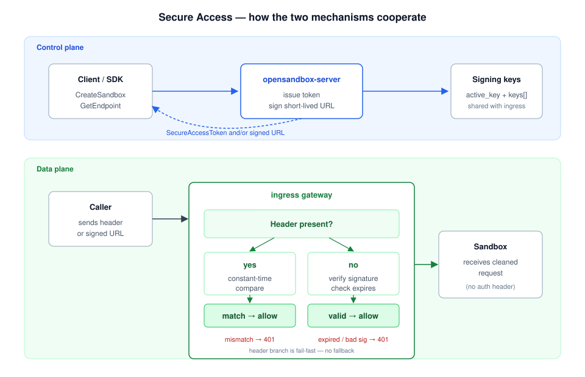

# Secure Access

Secure Access is OpenSandbox's inbound access control for sandbox endpoints.
When enabled on a sandbox, the ingress gateway (and the server proxy path)
require every caller to prove they are authorized before HTTP or WebSocket
traffic reaches the sandbox.

Its counterparts:

- [Credential Vault](/guides/credential-vault) — protects **outbound** requests.
- [Secure Container Runtime](/guides/secure-container) — isolates the **workload**.

Normative design: [OSEP-0011](https://github.com/opensandbox-group/OpenSandbox/blob/main/oseps/0011-secure-access-endpoint.md).

## Requirements

- Kubernetes runtime (Docker rejects `secureAccess: true` with `400`).
- `[ingress] mode = "gateway"`.
- Signed URLs additionally require `[ingress.secure_access]` with at least
  one signing key.

## How It Works



On the **control plane**, creating a sandbox with `secureAccess: true` and
calling `GetEndpoint` yields a per-sandbox opaque `SecureAccessToken`.
Passing `?expires=<unix_seconds>` also mints a signed, time-limited routing
token using the active key under `[ingress.secure_access]`.

On the **data plane**, the ingress gateway evaluates two mechanisms in a
fixed order:

1. **Header present** → constant-time compare against `SecureAccessToken`.
   Mismatch returns `401` immediately; there is **no** fallback to the
   signed-URL branch.
2. **Header absent** → parse the signed token, check `now ≤ expires`, verify
   the signature.

Requests that pass either check are forwarded upstream with the header or
signed prefix stripped, so the workload never sees the credential.

## Static Header Token

`GetEndpoint` returns an opaque `SecureAccessToken`. Clients attach it as:

```http
OpenSandbox-Secure-Access: <token>
```

SDKs pick this header up from the endpoint response automatically, so
application code usually does not touch it.

## Signed Short-Lived URLs

Mint a signed URL by adding `?expires=<unix_seconds>` (decimal `uint64`
epoch seconds, **not** milliseconds):

```
GET /sandboxes/{sandboxId}/endpoints/{port}?expires=<unix_seconds>
```

The returned routing token has the shape:

```
{sandbox_id}-{port}-{expires_b36}-{signature}
```

where `expires_b36` is base-36 seconds and `signature` is 8 hex digits plus
the 1-character `key_id` that signed it. The gateway accepts it in three
routing modes:

| Mode     | Where the token appears |
|----------|------------------------|
| wildcard | Host: `{token}.<parent>` |
| header   | Value of the sandbox routing header |
| uri      | Path prefix: `/{sandbox_id}/{port}/{expires_b36}/{signature}/…` |

Use signed URLs to hand out shareable, time-limited endpoints without
exposing the static token.

## Server Configuration

Signed URLs need signing keys; the static header token does not.

```toml
# ~/.sandbox.toml
[ingress]
mode = "gateway"

[ingress.gateway]
# Wildcard mode requires a wildcard address (e.g. *.sandbox.example.com);
# header and uri modes take a plain host (e.g. sandbox.example.com).
address = "*.sandbox.example.com"

[ingress.gateway.route]
mode = "wildcard"   # or "header" or "uri"

[ingress.secure_access]
active_key = "a"    # 1 char [0-9a-z], must exist in keys

[[ingress.secure_access.keys]]
key_id = "a"
key = "<base64-encoded-secret>"   # raw base64, no "base64:" prefix
```

The `opensandbox-server` Helm chart exposes the same shape under
`server.gateway.secureAccess` and wires the keys into both the server and the
ingress gateway.

To keep key material out of the config file, the server also accepts the
`OPENSANDBOX_SECURE_ACCESS_KEYS` (`a=<base64-secret>[,b=...]`) and
`OPENSANDBOX_SECURE_ACCESS_ACTIVE_KEY` (`a`) environment variables, which
override the TOML block; the chart's
`server.gateway.secureAccess.existingSecret` option sources them from a Secret.

**Key rotation.** Add a new key entry, deploy, then flip `active_key`.
Verification loads every configured key, so tokens signed by older keys stay
valid until you remove them — keep old entries until the longest possible
token lifetime has elapsed.

## Enabling It

Set `secureAccess: true` on create. SDK equivalents: Python `secure_access=True`,
JS/TS `secureAccess: true`, C# `SecureAccess = true`.

```bash
curl -X POST http://localhost:8080/v1/sandboxes \
  -H "Content-Type: application/json" \
  -d '{
    "image": {"uri": "python:3.11"},
    "resourceLimits": {"cpu": "500m", "memory": "512Mi"},
    "entrypoint": ["python", "/app/main.py"],
    "secureAccess": true
  }'
```

## Calling a Secured Endpoint

With the static header token:

```bash
# Fetch endpoint; the response carries OpenSandbox-Secure-Access.
curl -s http://localhost:8080/v1/sandboxes/${SANDBOX_ID}/endpoints/8080

curl -H "OpenSandbox-Secure-Access: ${TOKEN}" \
  https://${SANDBOX_ID}-8080.sandbox.example.com/
```

With a signed URL (valid for one hour):

```bash
EXPIRES=$(( $(date +%s) + 3600 ))
curl -s "http://localhost:8080/v1/sandboxes/${SANDBOX_ID}/endpoints/8080?expires=${EXPIRES}"
# → https://{sandbox_id}-8080-{expires_b36}-{signature}.sandbox.example.com/
```

## Errors

| Code | Cause |
|------|-------|
| `400` | `secureAccess: true` on Docker; malformed `expires` or routing token; invalid `expires_b36` / `port` / `signature`. |
| `401` | Header mismatch; signed URL expired; bad signature; unknown key ID; secure access required but no credential presented. |

Omitting `expires` on `GetEndpoint` is not a `400` — it returns the unsigned
response, still carrying the static `SecureAccessToken`.

## Notes

- Enforcement covers both ingress gateway and the server proxy path
  (`/v1/sandboxes/{id}/proxy/...`), HTTP and WebSocket.
- The gateway strips `OpenSandbox-Secure-Access` and any signed URI prefix
  before forwarding.
- In URI mode, path segments that resemble `expires_b36/signature` are only
  interpreted as a signed prefix when the sandbox actually has secure access
  enabled; otherwise the full path is forwarded unchanged.
- Secure Access is independent of the execd access token
  (`X-EXECD-ACCESS-TOKEN`) and Credential Vault; all can be used together.

## See Also

- [Credential Vault](/guides/credential-vault)
- [Secure Container Runtime](/guides/secure-container)
- [Ingress component](/components/ingress)
- [OSEP-0011](https://github.com/opensandbox-group/OpenSandbox/blob/main/oseps/0011-secure-access-endpoint.md)
