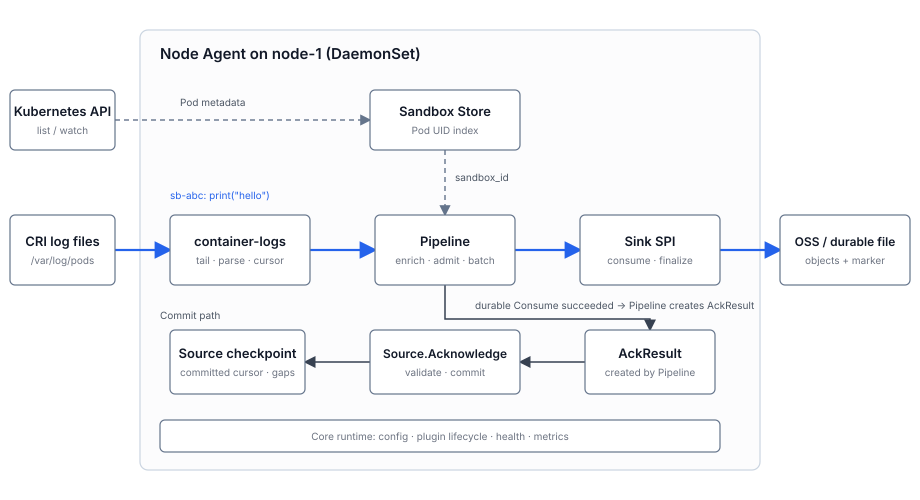

# OSEP-0019: Node Agent for Node-Level Sandbox Collection

<!-- toc -->
- [Summary](#summary)
- [Motivation](#motivation)
  - [Current state](#current-state)
  - [Why not an existing log shipper or per-sandbox sidecars](#why-not-an-existing-log-shipper-or-per-sandbox-sidecars)
  - [Goals](#goals)
  - [Non-Goals](#non-goals)
- [Requirements](#requirements)
- [Proposal](#proposal)
  - [Architecture overview](#architecture-overview)
  - [Notes/Constraints/Caveats](#notesconstraintscaveats)
  - [Risks and Mitigations](#risks-and-mitigations)
- [Design Details](#design-details)
  - [1. Component layout](#1-component-layout)
  - [2. Sandbox Store](#2-sandbox-store)
  - [3. Source and Sink SPI](#3-source-and-sink-spi)
  - [4. container-logs source](#4-container-logs-source)
  - [5. Record schema](#5-record-schema)
  - [6. Enrichment and processing pipeline](#6-enrichment-and-processing-pipeline)
  - [7. Sinks and storage backends](#7-sinks-and-storage-backends)
  - [8. Configuration](#8-configuration)
  - [9. Deployment](#9-deployment)
  - [10. Relationship to OSEP-0010 and the audit-trail roadmap item](#10-relationship-to-osep-0010-and-the-audit-trail-roadmap-item)
  - [11. Extensibility and future sources](#11-extensibility-and-future-sources)
  - [12. Failure modes and operational limits](#12-failure-modes-and-operational-limits)
- [Test Plan](#test-plan)
- [Drawbacks](#drawbacks)
- [Alternatives](#alternatives)
- [Infrastructure Needed](#infrastructure-needed)
- [Upgrade & Migration Strategy](#upgrade--migration-strategy)
<!-- /toc -->

## Summary

This proposal adds a Linux Kubernetes Node Agent, deployed as one DaemonSet Pod per node, that joins
CRI stdout/stderr from the main container of non-pool OpenSandbox Pods to sandbox identity,
processes records through a common Source/Pipeline/Sink contract, and writes them to one configured
backend; v1 ships a durable Alibaba Cloud OSS Sink, a durable local-file mode, and best-effort
stdout.

Durable delivery is at-least-once only within the coverage domain established when the Agent first
adopts the stream, while its local checkpoint remains available and the original source bytes can
still be read. Every marker exposes that fixed `coverage_started_at` boundary and makes no claim
about bytes irretrievably lost before adoption. The committed cursor advances only after the Sink
durably accepts a Batch and the Source commits the acknowledgement.

Known drops and unreadable source ranges appear in cumulative markers as `complete-with-drops` or
`incomplete`, while data the Agent could not observe is never claimed as covered; the Agent has no
separate disk spool, does not collect Pool task files in v1, and does not define the future
in-sandbox audit schema.

## Motivation

### Current state

On the standard non-pool creation path, one sandbox is represented by a Pod labeled
`opensandbox.io/id`. Its main container is named `sandbox` and runs `bootstrap.sh`, which starts
execd and the user entrypoint. With the default configuration, both processes write stdout/stderr to
the container standard streams. The container runtime persists those streams under the kubelet
layout `/var/log/pods/<ns>_<pod>_<uid>/<container>/`. The directory contains `<restart>.log` for the
current or an ended restart, uncompressed rotated files with timestamp suffixes, and `.gz`
compressed rotations. Pool mode runs the user entrypoint through task-executor and writes output to
task files, so it is outside the v1 collection scope.

OpenSandbox currently has no built-in node-level collection for this output. Operators must use ad
hoc `kubectl logs`, or deploy a generic log shipper and configure `sandbox_id` enrichment,
target-object layout, and lifecycle handling themselves. OSEP-0010 added in-process OpenTelemetry
metrics and structured stdout logs for execd, egress, and ingress, but it did not design node-level
collection of sandbox-container standard streams. This proposal adds that layer.

The OpenSandbox roadmap also lists an "Agent in-sandbox audit trail" that requires a separate OSEP.
It covers command and session execution, file operations, network access, identity context,
retention, and privacy. This proposal provides reusable node-level discovery, enrichment, and
delivery, but it does not predefine the audit record schema.

### Why not an existing log shipper or per-sandbox sidecars

Existing log shippers can read Kubernetes Pod labels and can filter and enrich non-pool Pods by
`opensandbox.io/id`. The reason to build a Node Agent is not a lack of Kubernetes metadata support.
OpenSandbox needs one place to control sandbox lifecycle, Source ownership, the strict relationship
between read cursors and Sink acknowledgements, and the target-object semantics of OSS AppendObject.
Future system-call, file-audit, and network-audit Sources are also not ordinary file-log inputs.
Putting these semantics in a dedicated Node Agent avoids implementing the core contract separately
in third-party plugin systems such as Vector VRL or Fluent Bit Lua/C.

A per-sandbox sidecar collector gives each collector the sandbox identity, but scales poorly. At
high sandbox density, the per-Pod CPU, memory, and connection overhead grows with the number of
sandboxes on the node. That is the density OpenSandbox is designed to optimize.

The selected design keeps discovery, enrichment, Source lifecycle, and acknowledgement coordination
in the Node Agent. Records go directly to a backend through a Sink registered at compile time and
selected at startup. A durable Sink acknowledgement advances the Source checkpoint through a
Source-owned acknowledgement token (`AckToken`). The Agent does not implement a separate disk spool
or general multi-backend fan-out.

### Goals

- Run one Node Agent per node as a DaemonSet and collect stdout/stderr from the main container of every matching non-pool sandbox Pod on that node.
- Enrich each record with a filterable **sandbox identity**: `sandbox_id` plus pod, namespace, node, container, and stream keys aligned with OSEP-0010.
- Support compile-time extensible storage backends. Ship a default `oss` Sink and a `file` Sink for debugging. Other backends, such as AWS S3, GCS, Loki, ClickHouse, or an OTLP collector, are implemented through the Sink SPI.
- Drive the hot-path tail with inotify and use low-frequency reconciliation to recover missed events. Deliver in batches. The Store makes no per-record API calls. Performance tests determine concrete throughput and resource thresholds.
- Remain extensible. Future system-call, file-audit, network-audit, and per-sandbox-signal collection can implement new Sources while reusing the Record envelope, logical stream identity (`StreamRef`), Source-owned acknowledgement token (`AckToken`), enrichment, and Sinks. A Source may extend the Store when it needs a new identity index.
- Default to safe behavior. Without a valid Sink target, the Agent does not start Sources or advance checkpoints. The process stays alive without crash-looping, and readiness and metrics clearly report incomplete configuration.

### Non-Goals

- Collecting execd per-command output files inside the container at `/tmp/{session}.stdout|stderr|output`.
- **System-call collection.** It is analyzed as a future Source in [§11](#11-extensibility-and-future-sources), but not designed here.
- The **single-host Docker runtime**. v1 targets Kubernetes only.
- Replacing OSEP-0010 in-process metrics. The two are complementary. OSEP-0010 remains the in-process OTLP metrics path; this OSEP sends container logs to a storage backend through a Sink.
- Becoming a general multi-backend fan-out and heavy buffering tier like Vector or the OpenTelemetry Collector. v1 enables one Sink. Simultaneous fan-out belongs in a Sink implementation or a later enhancement.
- Building a new storage system or defining the complete audit-record schema. That schema belongs in the audit-foundation OSEP.
- Collecting Pool sandbox logs. In Pool mode, task-executor runs the user entrypoint and writes stdout/stderr to task files rather than the main container standard streams. That mode requires a separate data-source design.

## Requirements

| ID | Requirement | Priority |
| --- | --- | --- |
| R1 | One Node Agent per node, deployed as a DaemonSet, collects stdout/stderr from the main `sandbox` container of non-pool sandbox Pods on that node that carry `opensandbox.io/id` and do not carry `sandbox.opensandbox.io/pool-name` | Must Have |
| R2 | Every record is enriched with `sandbox_id`, `k8s.cluster.name`, pod, namespace, node, container, stream, and Source. The cluster ID must be stable, and sandbox identity must align with OSEP-0010. | Must Have |
| R3 | Storage backends are extensible at compile time. Built-ins are the default `oss` Sink and the debug `file` Sink. The Sink SPI supports other backends. | Must Have |
| R4 | File Sources maintain separate runtime read position and persistent progress. Durable mode recovers from the committed cursor; stdout best-effort resumes from the processed cursor and makes no durable-delivery claim. Pipeline uses AckResult with a disposition and Guarantee only for records that became Deliveries. The Source directly persists byte ranges for Source-internal drops. In durable mode, passive gaps in tracked source ranges use ordered GapRecords and observable pre-adoption compressed history without a provable original range uses persistent CoverageGapRecords; best-effort only reports those observations. Advancing the contiguous source prefix atomically updates the cursor and cumulative result for the active Guarantee. | Must Have |
| R5 | A global byte budget, per-sandbox queue limit, backpressure, and drop accounting bound resource use. A high-throughput sandbox must not consume the global queue without limit. | Must Have |
| R6 | Source and Sink implementations are extensible at compile time. The common pipeline treats AckToken and EndToken values as opaque so future Sources are not bound to file-byte offsets. Sources that need new identity indexes may extend the Store. | Must Have |
| R7 | inotify drives the hot path. Low-frequency reconciliation handles missed events and inotify overflow. Delivery is batched, and the Store makes no per-record API calls. | Must Have |
| R8 | v1 runs with least privilege: read-only access to host log files and no elevated capabilities or eBPF. Privileged operation is reserved for a future syscall Source. | Should Have |
| R9 | v1 is configured through environment variables generated by Helm values. Without a valid Sink target, it does not start Sources or advance checkpoints; the process stays alive and reports why it is not ready. | Should Have |
| R10 | The Agent is self-observable, with semantically distinct health and readiness endpoints and optional pprof. With an explicit OTLP endpoint it reuses `components/internal/telemetry`; that shared module gains a default-disabled `DisableEndpointFallback` option enabled by the Node Agent. Export failures must not block the data path. | Should Have |

## Proposal

Introduce `components/nodeagent`, a Go component deployed as an optional DaemonSet. The core owns
configuration, extension lifecycle, health, and self-metrics. A node-local Sandbox Store tracks
identity and lifecycle; Sources create records and source-owned acknowledgement tokens; Pipeline
enriches and batches them; one configured Sink persists them. Sources and Sinks are registered at
compile time. v1 does not load runtime plugins or fan out to several Sinks.

### Architecture overview

The diagram follows one record from sandbox `sb-abc` on `node-1`. The sandbox writes
`print("hello")` to stdout; the container runtime writes a CRI line under `/var/log/pods`;
`container-logs` reads it; Pipeline adds `sandbox_id=sb-abc`; and the Sink appends the Batch to OSS
or a durable file. The lower path is acknowledgement, not a second output path. After durable
Consume succeeds, Pipeline creates an `AckResult` from the AckToken it retained and calls
`Source.Acknowledge`; only that local transaction advances the committed cursor.



The durable result for one logical stream is published as a numbered cumulative Revision. Finalize
closes the Revision's object generations and creates an immutable marker. Finalize means the
snapshot is frozen, not necessarily complete:

| Status | Meaning within this marker's coverage domain through the Revision |
| --- | --- |
| `complete` | No intentional drop and no unresolved source gap in the coverage domain. At-least-once still allows duplicates. |
| `complete-with-drops` | At least one record was intentionally dropped, but no source gap remains unresolved. |
| `incomplete` | At least one tracked range or observed pre-adoption history remains unreadable or unproven. This takes precedence over drops. |

Markers use `<container>.finalized.<revision>.json`; consumers inspect the JSON `status` rather than
infer completeness from the file name. The coverage domain begins with the adoption snapshot at the
marker's persisted `coverage_started_at`: it contains every source artifact visible in that snapshot
and subsequently monitored activity. It may therefore contain readable records timestamped before
the boundary, but it does not claim history that had already vanished before adoption. Revision N is
cumulative over that domain through N. Late data or an exact Gap repair is appended to a new object
generation in a later Revision and does not restore physical object order. Stdout best-effort uses
the same lifecycle callbacks but publishes no marker or completeness status.

The proposal makes five design choices:

1. **Source-owned progress.** Pipeline may validate the common AckToken envelope but treats the Source-defined value as opaque. A Sink never sees it.
2. **Bounded at-least-once.** Durable replay starts from a committed cursor. There is no Agent spool; kubelet log retention is the only payload buffer before Sink persistence.
3. **Explicit loss accounting.** Intentional drops and unreadable source ranges are distinct outcomes. Neither may be silently converted into successful delivery.
4. **Serial finalization.** One StreamRef has at most one in-flight Batch and one finalizing Revision. Revision N+1 starts only after N's marker, Pipeline state, and end acknowledgement complete.
5. **Fail closed.** Invalid configuration, ambiguous file identity, target mismatch, exhausted durable state, or an unverified OSS bucket keeps Sources stopped or readiness failed without advancing progress.

### Notes/Constraints/Caveats

- The main container stream combines `bootstrap.sh`, execd, and user-entrypoint output. v1 collects the complete stream and does not classify its producer.
- CRI partial records are reassembled before delivery. Resource limits may produce an intentional drop, which is recorded in the outcome.
- High-cardinality sandbox and Pod identifiers belong to log records and object metadata, never to Node Agent metric labels.
- v1 Store discovery uses only the Kubernetes API. CRI/containerd PID attribution and eBPF privileges are deferred to future Sources.
- The default OSS protocol is Alibaba Cloud specific. Portable backends require another Sink implementation.

### Risks and Mitigations

| Risk | Mitigation |
| --- | --- |
| Backend outage or slow response | Bound memory, stop reads under backpressure, retain the committed cursor, and retry with timeout and jittered backoff. |
| kubelet rotation removes unread data | Follow old and new generations concurrently, reconcile periodically, and publish a Gap instead of claiming completeness. |
| State or target identity is inconsistent | Validate fingerprints, writer/target metadata, and the local state schema before reading; never reset silently. |
| One sandbox monopolizes the node | Enforce global and per-sandbox byte budgets plus an optional per-sandbox rate limit. |
| Privileged host access broadens the attack surface | Mount only Pod logs read-only, isolate writable state, drop capabilities, and reserve stronger privileges for a separate future design. |

## Design Details

### 1. Component layout

```plain
components/nodeagent/
  main.go                    # startup, signals, extension registration
  pkg/
    config/                  # environment parsing and validation
    store/                   # Kubernetes watch and sandbox identity
    source/                  # Source SPI and container-logs
    pipeline/                # enrichment, admission, batching, acknowledgement
    sink/                    # Sink SPI, OSS, durable file, stdout
    state/                   # bbolt namespaces and schema
    server/                  # health, readiness, optional pprof
kubernetes/charts/opensandbox-node-agent/
```

The component follows existing Go-component conventions and reuses `components/internal` for zap
logging, self-telemetry, `safego`, and version reporting.

### 2. Sandbox Store

The Store is the node-local identity and lifecycle view used by Sources and Pipeline. v1 watches
Pods through the Kubernetes API with `fieldSelector=spec.nodeName=$NODE_NAME`, then applies
`opensandbox.io/id,!sandbox.opensandbox.io/pool-name` locally. Label selectors are intentionally not
sent to the API: an already tracked Pod must continue producing updates after its identity label
changes or a Pool label is added.

```plain
podUID -> {
  sandbox_id, namespace, pod_name, pod_uid,
  node_name, container_name, log_directory,
  lifecycle_state
}
```

The Store exposes Pod-UID and log-path lookup. Source creation freezes the original Resource
identity in checkpoint state. Removing or changing `opensandbox.io/id`, adding the Pool label, or
observing an impossible UID/path rebind stops new Delivery for that StreamRef. Durable mode records
any uncovered tracked range as a Gap and finalizes `incomplete`; best-effort stops the stream
without publishing a durable result. Restoring labels does not rebind the old StreamRef.

After Pod deletion, the Store retains identity while already discovered files drain. Identity
eviction is not stream finalization; the Source end predicate in §4 remains authoritative. Sources
start only after initial informer sync. During a watch outage they may process already known streams
from the last cache but discover no new ones. A stale-cache threshold fails readiness; successful
relist triggers full reconciliation.

### 3. Source and Sink SPI

The following terms are normative:

| Term | Meaning |
| --- | --- |
| `StreamRef` | One logical Source stream. For `container-logs`: Source name, Pod UID, and container name. |
| `FileRef` / `SourceSpan` | One physical CRI generation and a half-open byte range within it. Source generations are independent from Sink object generations. |
| `AckToken` | Source-created acknowledgement token for input that became a Delivery. Pipeline may validate the common envelope but cannot interpret or construct its `Value`; Sink never receives it. |
| committed / processed cursor | Durable progress after Sink persistence and Source transaction / best-effort progress after synchronous output handling. Restart trusts only the applicable cursor. |
| `SourceDropRecord` | Source-owned byte range discarded before a Delivery existed. It creates no AckResult. |
| `GapRecord` | Ordered, known unreadable range in a tracked FileRef. An exact range may later be repaired. |
| `CoverageGapRecord` | Observable compressed history before the first readable generation without a provable original byte range. It is unordered and not repairable in v1. |
| `coverage_started_at` | Fixed UTC time persisted after the Source installs its parent watch and before its first full scan. It timestamps the adoption snapshot; it is not a lower bound on record timestamps. |
| Revision | Cumulative finalized snapshot from `coverage_started_at`, numbered from 1. A higher Revision may add late or repaired data without mutating earlier objects. |

The public extension contract is intentionally smaller than the Source's internal file model:

```go
type RecordKind string

const RecordKindContainerLog RecordKind = "container-log"

type Capabilities struct {
    RecordKinds []RecordKind
}

type Resource struct {
    SandboxID   string
    ClusterName string
    Namespace   string
    PodName     string
    PodUID      string
    NodeName    string
    Container   string
}

type Record struct {
    Kind       RecordKind
    Timestamp  time.Time
    Body       []byte
    Resource   Resource
    Attributes map[string]string
}

type StreamRef struct {
    ID string // container-logs: Source name + Pod UID + container
}

type AckToken struct {
    ID        string
    Source    string
    StreamRef StreamRef
    Value     []byte // Source-defined and opaque to Pipeline
}

type EndToken struct {
    ID        string
    Source    string
    StreamRef StreamRef
    Value     []byte // stable for one StreamRef Revision
}

type AckDisposition string
const (
    AckDelivered       AckDisposition = "delivered"
    AckIntentionalDrop AckDisposition = "intentional-drop"
)

type DeliveryGuarantee string
const (
    GuaranteeDurable    DeliveryGuarantee = "durable"
    GuaranteeBestEffort DeliveryGuarantee = "best-effort"
)

type AckResult struct {
    Token       AckToken
    Disposition AckDisposition
    Reason      string
    Guarantee   DeliveryGuarantee
}

type SourceOutcome struct {
    HadDrops      bool
    HadSourceGaps bool
    LossReasons   []string
}

type Delivery struct {
    Record    Record
    StreamRef StreamRef
    AckToken  AckToken
    RecordID  string
}

type StreamEnd struct {
    StreamRef         StreamRef
    EndToken          EndToken
    Revision          uint64
    CoverageStartedAt time.Time
    Resource          Resource
    Outcome           SourceOutcome
}

type SourceEvent struct {
    Delivery *Delivery
    End      *StreamEnd // exactly one field is non-nil
}

type Source interface {
    Capabilities() Capabilities
    Start(context.Context, chan<- SourceEvent) error
    Acknowledge(context.Context, []AckResult) error
    AcknowledgeEnd(context.Context, EndToken) error
    Stop(context.Context) error
}

type BatchItem struct {
    Record   Record
    RecordID string
}

type Batch struct {
    StreamRef StreamRef
    Items     []BatchItem
}

type FinalizeRequest struct {
    FinalizeID        string
    TargetID          string
    StreamRef         StreamRef
    Revision          uint64
    CoverageStartedAt time.Time
    Resource          Resource
    Outcome           SourceOutcome
    FinalizedAt       time.Time
}

type Sink interface {
    Capabilities() Capabilities
    Guarantee() DeliveryGuarantee
    Consume(context.Context, Batch) error
    Finalize(context.Context, FinalizeRequest) error
    Close(context.Context) error
}
```

`CoverageStartedAt` is persisted once and remains identical in every Revision for a StreamRef.
`SourceOutcome.HadDrops` and drop reasons are cumulative and monotonic. `HadSourceGaps` instead means
that at least one GapRecord or CoverageGapRecord is unresolved in the current Revision, so an exact
repair may change it from true to false. `LossReasons` is the sorted union of cumulative drop reasons
and reasons belonging to currently unresolved gaps; a gap-only reason disappears after the last gap
with that reason resolves. Earlier markers remain immutable. A repaired later Revision becomes
`complete` when it has no drops, or `complete-with-drops` when cumulative drops remain.

`Capabilities.RecordKinds` is the complete set a Source may emit or a Sink accepts. Startup rejects
the configuration unless every enabled Source kind is accepted by the single configured Sink.
`Source.Start` uses one event channel, and events for the same StreamRef are normative FIFO: a Source
emits StreamEnd only after it has emitted every Delivery and fixed every Source-internal result in
that Revision. `AcknowledgeEnd` rejects until those results are durably committed. Pipeline and Sink
treat all token Values as opaque. When Pipeline receives StreamEnd, per-stream FIFO lets it flush
and acknowledge every earlier Delivery before Finalize.

Factories receive configuration, the Sandbox Store when applicable, and the Node Agent state API.
The state package exposes component-specific operations over separate logical buckets; those APIs,
rather than direct bbolt transactions, define the persistence boundary. Sources and Sinks declare
compatible Record kinds. Registration is compile time through explicit packages and imports; v1 has
no dynamic loading.

For one StreamRef, Pipeline permits one in-flight Batch. Consume is batch-level all-or-retry: a
durable Sink returns success only after every item reaches its documented durable point. Pipeline
then creates AckResults from its retained Batch-to-token mapping. `Source.Acknowledge` validates
Source/StreamRef, applies results in Source order, and commits cursor plus cumulative outcome in one
transaction. Duplicate acknowledgement of an already committed range is idempotent; conflicting
disposition or mixed Guarantee is rejected. A Sink error, unknown result, or failed acknowledgement
retains the same Batch for retry. Different StreamRefs may run concurrently.

Shutdown stops discovery, stops Sources, drains in-flight Consume/Acknowledge work, completes
persisted finalize intents, and closes the Sink. Timeout exits non-zero without advancing unresolved
progress.

### 4. container-logs source

`container-logs` is the only v1 Source. It reads the main `sandbox` container of matching non-pool
Pods from the CRI/kubelet layout `/var/log/pods/<namespace>_<pod>_<uid>/<container>/`. This contract
is independent of the OCI runtime, including gVisor or Kata/Firecracker behind kubelet. fast-sandbox
and Pool task files do not use this path and are outside v1.

**Discovery and ordering.** Install the parent watch before scanning the complete container
directory. In durable mode, persist an adoption intent containing `coverage_started_at` and
`initial_scan_complete=false` after that watch is installed and before the first full scan. The
successful scan atomically records all discovered FileRefs and CoverageGapRecords and changes the
flag to true. A restart with an incomplete intent first persists a permanent
`adoption-scan-interrupted` CoverageGapRecord, then repeats the scan with the original boundary.
Recognize `<restart>.log`, uncompressed `<restart>.log.<timestamp>`, and final `.gz` artifacts;
ignore transitional `.tmp` files. On first adoption, order readable files by numeric restart count
and rotation timestamp, with the base file last, and start at offset 0. Readable older records may
be delivered, but bytes that vanished before `coverage_started_at` are outside the completeness
claim. Existing older `.gz` artifacts are visible in the adoption snapshot and create a permanent
durable CoverageGapRecord before delivery begins; stdout only reports the observation.
Reconciliation handles missed events, inotify overflow, watch replacement, and directory
recreation.

After adoption, each durable stream stores an open monitoring epoch. An active stream can close that
epoch only after reaching the Source end predicate. On startup, a non-ended stream left by an earlier
epoch first records a permanent `monitor-interrupted` CoverageGapRecord; this conservatively covers
bytes that may have appeared and vanished while no Agent was watching. inotify overflow,
watch-channel failure, or watch replacement similarly persists a permanent `watch-discontinuity`
CoverageGapRecord before reconciliation resumes. Losing a known FileRef still creates the ordered
GapRecord described below. These rules let `complete` require continuous monitoring rather than
infer coverage from a later empty directory scan.

**Rotation and identity.** A rename does not close the old FileRef. Open the new base file
immediately and continue the old one until container termination or until a newer generation has
taken over and the old file remains stable across reconciliation. File identity combines a persisted
UUID with device, inode, a fixed first-byte prefix hash, observed size, and mtime. Recovery requires
a one-to-one match and never reuses an old cursor after mismatch or inode reuse. Ambiguity fails
readiness. Losing an unacknowledged tracked range to compression or reclamation creates a durable
GapRecord; v1 does not decompress `.gz` or infer original offsets.

**CRI records and bounds.** Reassemble `P` fragments by StreamRef and stdout/stderr until `F`. A
timeout emits the accumulated record with `[opensandbox: partial-timeout]`; later fragments begin
with `[opensandbox: continuation-after-timeout]`. End without `F` emits `[opensandbox:
incomplete-partial]`. The other terminal annotations are `[opensandbox: truncated]` and
`[opensandbox: span-limit]`; the first terminal condition wins. `NODEAGENT_MAX_LINE_BYTES` bounds
retained source-body bytes before annotations, and memory calculations reserve their maximum
additional 74 bytes. Malformed physical lines and discarded bytes after truncation/span limit become
bounded SourceDropRecords with low-cardinality reasons `malformed-cri`, `line-truncated`, or
`partial-span-limit` before their ranges are crossed. They never create a Delivery or AckResult.

```plain
2026-07-23T10:00:00.123456789Z stdout F hello world
2026-07-23T10:00:01.000000000Z stdout P a long line exceeded the runtime's chunk
2026-07-23T10:00:01.000000005Z stdout F size, so it was split into fragments
```

**Gaps and repair.** AckResults, SourceDropRecords, and GapRecords form one ordered source prefix. A
Gap stores the original FileRef fingerprint, start, optional end, optional resume position, reason,
and resolved state; v1 reasons include `compressed-rotation`, `file-reclaimed`,
`fingerprint-mismatch`, and `late-after-finalize`. Unknown final size remains `ToOffset=nil`; last
observed size is not EOF. `ResumeAt=nil` means the Gap is currently terminal; if a later cursor
appears before state GC, the Source fixes ResumeAt atomically before admitting that later result.
The Source may continue after a Gap only after persisting it and recomputing the current outcome. If
the exact physical range is later recovered under the same fingerprint, repair Deliveries bind to
that Gap and mark it resolved only after durable acknowledgement. The Source then recomputes
`had_source_gaps` from all unresolved GapRecords and CoverageGapRecords in the same transaction.
Repair appends to a new generation in a higher Revision; consumers cannot reconstruct exact
cross-Revision source order from object order. CoverageGapRecords use
`preexisting-compressed-rotation`, `adoption-scan-interrupted`, `monitor-interrupted`, or
`watch-discontinuity` and remain permanently unresolved in v1.

**End and late data.** A Revision may end only after the Pod/container is terminated or deleted,
every known FileRef is at stable EOF or covered by a Gap, a full reconciliation finds nothing new,
and every previously emitted ordered result is complete. A stream containing only CoverageGapRecords
therefore has no Delivery to acknowledge before StreamEnd. API cache staleness prevents directory
disappearance from proving end. Revision N+1 is created only after N fully Finalizes and
AcknowledgeEnd completes. Data discovered while N is finalizing is persisted as `late_pending`; if
it cannot later be reopened by fingerprint, it becomes a `late-after-finalize` Gap.

**Local state.** `NODEAGENT_STATE_DIR/checkpoint.db` is one synchronously committed local file
managed by bbolt, an embedded transactional key-value database linked into the Agent. It requires no
separate database service and contains recovery metadata, never log bodies. Source, Sink, and
Pipeline own separate buckets. The first creation stores a stable `writer_id`; a file lock excludes a
second Agent using the same state directory. Durable mode stores the fixed `coverage_started_at`,
committed cursors, FileRef identity, drops, gaps, outcome, closed objects, and finalization state.
Best-effort stores only processed progress and identity. Restart discards queues and in-memory
partial state, then rereads from the
applicable cursor. A crash after Sink success but before Source commit therefore replays a bounded
tail.

The database has `schema_version=1`. Unknown version, corruption, target mismatch, or failed
validation keeps the Agent unready and never silently resets state. `NODEAGENT_STATE_MAX_BYTES`
blocks growth only when a transaction cannot reuse free pages; checkpoint, Finalize, and GC retain a
reserved drain budget. Ended state keeps the identities, gaps, outcome, target, and closed objects
required to reopen before a fixed repair deadline. Admitted work may finish after the cutoff, but
the deadline never moves. After draining, state becomes non-reopenable `expired` even if the log
directory remains. Bytes first observed then are outside the guarantee and only increment
`post-repair-deadline`. Final GC also requires directory disappearance and no in-flight or cleanup
reference.

### 5. Record schema

`Record` is the common envelope for current logs and future signal types. Required Resource keys are
`sandbox_id`, `k8s.cluster.name`, namespace, Pod name/UID, node, and container. `container-logs`
additionally sets `attributes.source` to `container.stdout` or `container.stderr`, plus `stream` and
`log.file.path`. `NODEAGENT_CLUSTER_ID` is stable for the cluster lifetime and prevents collisions
when clusters share a target.

Body is bytes rather than a required UTF-8 string. OSS and file write canonical text lines; an
optional NDJSON helper Base64-encodes invalid UTF-8 and marks the encoding. Delivery-only StreamRef,
AckToken, and RecordID are not written into the default text line. RecordID is deterministic from
StreamRef and stable SourceSpan identities so a custom idempotent Sink can use it.

```plain
# raw CRI input
2026-07-23T10:00:00.123456789Z stdout F hello world

# canonical Sink line after CRI parsing and enrichment
2026-07-23T10:00:00.123456789Z stdout hello world
```

Identity is stored once in OSS object metadata or derived from the durable-file path rather than
repeated on every line. This keeps the default format append-friendly; consumers join line data with
the marker/object Resource.

### 6. Enrichment and processing pipeline

Pipeline performs five ordered stages:

1. Accept the frozen sandbox identity attached by the Source. The Source does not emit a record without `sandbox_id` into a durable target.
2. Apply optional per-sandbox rate limiting and global/per-sandbox byte admission. v1 has no filtering, sampling, or redaction processor SPI.
3. Group the current flush window into transient Batches by StreamRef. All accumulator bytes count against the one global budget. Per-sandbox limits prevent one sandbox from consuming the whole budget, but the shared `block` path does not guarantee latency isolation between sandboxes.
4. Call Sink Consume. On success create `delivered` AckResults; a Pipeline policy drop creates `intentional-drop`. Source-internal parse/drop records never pass through this stage.
5. Call `Source.Acknowledge`. Release the Batch and schedule the next one for that StreamRef only after the Source transaction commits.

Pipeline may reorder different StreamRefs but preserves ordinary Source emission order within one
open Revision. Late or repair data in a higher Revision is the documented exception. At capacity,
`block` stops reads. `drop` is allowed only while enough memory remains to retain its
acknowledgement metadata; otherwise the Source stops before reading more input.

When Pipeline receives StreamEnd, per-stream FIFO guarantees that every Delivery in that Revision
was received earlier. Pipeline flushes and acknowledges all work already held by that stream worker,
then persists a finalize intent containing target ID, deterministic FinalizeID, Revision, and a
FinalizedAt fixed on first attempt. It calls Sink Finalize, persists Pipeline finalized state, and
calls idempotent `Source.AcknowledgeEnd`. A crash resumes the same intent. No step may create
different identifiers or start a later Revision.

After Finalize, reopenable ended state continues watch/reconciliation until its fixed repair
deadline. Expiration removes reopen capability but retains the minimal evidence required for final
state and durable-file cleanup. OSS markers are external history, not GC eligibility: v1 performs
OSS cleanup only after a target-wide drain confirms zero active/reopenable streams and GC backlog,
all tracked log directories are gone, and related Agents are stopped. A marker-aware offline tool
persists a cleanup manifest and deletes complete object families. It never treats marker existence
alone as permission to delete.

### 7. Sinks and storage backends

One Sink is enabled for a process. `oss` and file-with-path declare `durable`; file-without-path
writes stdout and declares `best-effort`. A durable Consume returns success only after the whole
Batch reaches the backend's durable point. Finalize is idempotent for `(target_id, StreamRef,
Revision, FinalizeID)`.

**Durable file.** `NODEAGENT_FILE_PATH` resolves once to a persistent `canonical_root`. Each
StreamRef owns `<cluster_id>/<namespace>/<sandbox_id>/<pod_uid>/`; generation 0 is
`<container>.log`, then `<container>.<generation>.log`. Opens begin from the root directory fd, use
`openat`/`O_NOFOLLOW`, reject non-regular files and `..`, and validate persisted device/inode.

Before appending L bytes at position P, persist `append_intent={P,L,request_sha256,device,inode}`.
Write, flush, `fdatasync`, then transactionally commit position and CRC64 and clear the intent.
Recovery accepts only actual size Q in `[P,P+L]`, truncates any uncommitted tail back to P, syncs,
clears the intent, and replays from the Source committed cursor. Identity mismatch or size outside
the range fails readiness. Rollover similarly persists one `generation_transition` before creating
and syncing the next file.

Finalize closes and syncs the current generation, fixes its final size/CRC64, writes a deterministic
temporary marker, syncs its directory, persists temporary identity and digest, then publishes with
no-replace rename and syncs again. Recovery validates the exact temporary/final bytes; an unknown or
conflicting file fails closed. Capacity limits apply per generation, per object family, and across
canonical_root. Never delete one generation to make room. Whole-family cleanup first creates a bbolt
tombstone, then a cleanup intent, atomically renames the directory into GC staging, syncs the
parent, and deletes asynchronously. Non-empty orphan files are identity-bound and quarantined before
Source replay; they are never silently adopted.

**OSS append.** The object family prefix is:

```plain
<prefix>/<cluster_id>/<namespace>/<sandbox_id>/<pod_uid>/
  <container>.log
  <container>.<generation>.log
  <container>.finalized.<revision>.json
```

Each record is one `<RFC3339Nano timestamp> <stdout|stderr> <body>\n` byte line. Data objects use
`application/octet-stream`; identity remains in object metadata and markers rather than being
repeated in every line.

The first AppendObject creates an object at position 0 with writer ID, target ID, StreamRef,
generation, Resource, and original log-directory metadata. Later appends carry no metadata. Before
sending L bytes at server position P, persist an append intent with request digest. Query server
length Q after an unknown outcome:

| Observation | Same process | After restart |
| --- | --- | --- |
| `Q=P` | Retry the same Batch. | Rebuild from committed Source progress. |
| `Q=P+L` | Treat the append as accepted only when the in-memory Batch and digest still match. | Do not acknowledge; rebuild and allow duplicate replay. |
| any other Q | Fail readiness; do not skip or truncate OSS. | Same. |

Position and object metadata must match local state before every recovery append. Rollover is
persisted before the first append to a new generation. A finalized generation is immutable; late
data always uses a new generation.

Before Sources start, and again immediately before every marker PutObject, verify bucket versioning
is disabled, WORM is not configured, and no lifecycle prefix contains or is contained by the managed
`<prefix>/<cluster_id>/`. Denied, unknown, or conflicting responses fail readiness/Finalize. Agent
credentials need PutObject plus GetObject and the three preflight reads, but no DeleteObject or
bucket-configuration mutation.

**Marker contract.** The compact UTF-8 JSON object uses `application/json` and `schema_version=1`.
All shown fields are required. Objects are cumulative and sorted by contiguous generation; the list
may be empty when the stream created no data generation. `coverage_started_at` is fixed across
Revisions and identifies the adoption snapshot that begins the coverage domain. `had_drops` is
cumulative;
`had_source_gaps` reflects currently unresolved gaps and may clear after an exact repair.
`loss_reasons` is sorted and deduplicated and follows the SourceOutcome transition rules in §3.
`status` is `incomplete` when `had_source_gaps`, otherwise `complete-with-drops` when `had_drops`,
otherwise `complete`. OSS uses the final server `x-oss-hash-crc64ecma`; durable file computes
CRC64-ECMA after fsync. `crc64` is a decimal string to avoid JavaScript precision loss. Object size
and CRC64 become immutable after marker publication. Consumers ignore unknown fields and loss
reasons, select the numerically highest contiguous valid Revision, and reject missing required
fields, discontinuity, changed objects, a changing `coverage_started_at`, or status/outcome
disagreement.

```json
{
  "schema_version": 1,
  "target_id": "sha256:2ab2651cce3799b9c186f5aa9ea47c21756ae28624bb6cde737de00469fce49d",
  "finalize_id": "sha256:4c946fca12776e0338659e8d83b86703086edb1635e57aa1c618af05d6cf1f27",
  "revision": 2,
  "stream_ref": "container-logs/u123/sandbox",
  "resource": {
    "sandbox_id": "sb-abc",
    "k8s.namespace.name": "team-a",
    "k8s.pod.name": "sb-abc-pod",
    "k8s.pod.uid": "u123",
    "k8s.container.name": "sandbox",
    "k8s.node.name": "node-1",
    "k8s.cluster.name": "prod-a"
  },
  "coverage_started_at": "2026-07-23T09:58:00Z",
  "status": "incomplete",
  "had_drops": false,
  "had_source_gaps": true,
  "loss_reasons": ["late-after-finalize"],
  "finalized_at": "2026-07-23T10:05:00Z",
  "objects": [
    {
      "key": "logs/prod-a/team-a/sb-abc/u123/sandbox.log",
      "generation": 0,
      "size": 50,
      "crc64": "15546583244584165199"
    }
  ]
}
```

Target identity excludes credentials. Define `lp(x)=ASCII(UTF-8 byte length)+":"+UTF-8(x)`. After
lowercasing the HTTPS scheme/host, removing default `:443` and trailing `/`, and rejecting endpoint
path/query/fragment, OSS uses `"sha256:"+lowerhex(SHA-256("opensandbox-nodeagent-target-v1\0" ||
lp("oss") || lp(endpoint) || lp(bucket) || lp(prefix) || lp(cluster_id)))`. Durable file substitutes
`lp("file") || lp(canonical_root) || lp(cluster_id) || lp(node_name)`. `finalize_id` is
`"sha256:"+lowerhex(SHA-256("opensandbox-nodeagent-finalize-v1\0" || lp(stream_ref) ||
lp(decimal_revision) || lp(target_id)))`. Prefix loses leading/trailing `/`; decimal Revision has no
leading zero; `\0` is one zero byte. FinalizeID identifies an operation and is not a marker-content
digest. Exact test vectors are required before implementation merges.

Known JSON members use the order shown; extension members follow known members sorted by UTF-8 field
name. Strings remain UTF-8: escape quote/backslash, use short escapes for
`U+0008/000C/000A/000D/0009`, encode other `U+0000..001F` as lowercase `\u00xx`, and do not escape
`/` or other characters. Duplicate members, BOM, indentation, trailing newline, and other
nondeterminism are forbidden. Numbers use JSON integers only through `2^53-1`; timestamps are UTC
RFC3339 at second precision. The marker file name, JSON Revision, StreamRef, and Resource must
agree. A marker is written with overwrite forbidden and an existing key succeeds only when its bytes
match exactly.

Custom Sinks implement the SPI, declare compatible Record kinds and a durable reception point, and
may use RecordID for native idempotency. Portability to S3, GCS, Kafka, Loki, ClickHouse, or OTLP is
an extension, not a claim of the built-in OSS protocol.

### 8. Configuration

Helm values generate environment variables; v1 has no dynamic reload. Unknown or multiple Sinks,
incompatible capabilities, missing applicable bounds, invalid target, or state-target mismatch keeps
the process alive but starts no Source and reports a specific readiness reason. OSS credentials are
loaded from environment variables at startup; rotating the backing Secret requires an Agent restart
and does not change target identity.

Byte/file values are unsigned ASCII decimal without unit suffix; applicable limits are positive
except rate limit and file retention, whose zero meanings are documented below. Durations use Go
`time.ParseDuration` and must be positive except zero file retention. Helm schema validates
expressible syntax/ranges; Agent startup validation remains authoritative for duration overflow,
filesystem identity, cgroup/FD/inotify reserve, and cross-field budgets. Internal queue counts,
concurrency, flush grouping, and safety reserve are derived and are not public contracts.

| Key | v1 contract |
| --- | --- |
| `NODE_NAME` / `NODEAGENT_CLUSTER_ID` | Required node and stable cluster identity matching `[a-z0-9]([-a-z0-9]{0,61}[a-z0-9])?`. |
| `NODEAGENT_SOURCES` / `NODEAGENT_SINKS` | Exactly `container-logs` and one compiled Sink: `oss` or `file`. |
| `NODEAGENT_OSS_ENDPOINT`, `NODEAGENT_OSS_BUCKET`, `NODEAGENT_OSS_KEY_PREFIX` | Required OSS target identity; HTTPS endpoint. |
| `OSS_ACCESS_KEY_ID`, `OSS_ACCESS_KEY_SECRET`, optional `OSS_SESSION_TOKEN` | OSS credentials; short-lived STS/refreshable provider preferred. |
| `NODEAGENT_FILE_PATH` | Optional persistent absolute root. Absent means best-effort stdout; present means durable file. |
| `NODEAGENT_FILE_MAX_BYTES`, `NODEAGENT_FILE_MAX_FILES`, `NODEAGENT_FILE_MAX_TOTAL_BYTES`, `NODEAGENT_FILE_RETENTION` | Required in durable-file mode. Zero retention means no business hold after repair deadline. |
| `NODEAGENT_LOG_ROOT` / `NODEAGENT_STATE_DIR` | Defaults `/var/log/pods` and `/var/lib/opensandbox/nodeagent`; reject root, globs, traversal, and unsafe mounts. |
| `NODEAGENT_MEMORY_BUDGET_BYTES` / `NODEAGENT_STATE_MAX_BYTES` | Required variable-memory and bbolt growth bounds with reserved drain capacity. |
| `NODEAGENT_ENDED_STATE_RETENTION` | Fixed late/repair admission window set by first AcknowledgeEnd; later Revisions do not extend it. |
| `NODEAGENT_PER_SANDBOX_QUEUE_BYTES` / `NODEAGENT_PER_SANDBOX_RATE_LIMIT` | Required occupancy bound and optional records/second token bucket; absent/zero rate disables it. |
| `NODEAGENT_MAX_LINE_BYTES` / `NODEAGENT_PARTIAL_TIMEOUT` | Required retained source-body bound plus separately reserved 74-byte annotations, and partial wait. |
| `NODEAGENT_DROP_POLICY` | `block` (default) or `drop`; every drop enters outcome. |
| `NODEAGENT_SINK_TIMEOUT` / `NODEAGENT_RETRY_MAX_INTERVAL` | Required timeout for one Consume or one backend request, and maximum jittered retry interval. A multi-object Finalize is bounded by its lifecycle context rather than one request timeout. |
| `NODEAGENT_SERVER_ADDR` / `NODEAGENT_PPROF_ADDR` | Health address (default `:8080`) and optional, default-disabled pprof. |
| `OTEL_EXPORTER_OTLP_METRICS_ENDPOINT` / `OTEL_EXPORTER_OTLP_ENDPOINT` | Optional self-metrics export. Node Agent disables inherited HOST_IP/hostinfo fallback. |

`NODEAGENT_CONTAINER_NAMES` is reserved; unset means `sandbox`, and v1 rejects any other or multiple
containers. Changing Sink target requires an operator drain, Agent stop, and archival/removal of the
whole state directory; per-StreamRef state deletion is not a supported target migration.

### 9. Deployment

Ship an optional `kubernetes/charts/opensandbox-node-agent` chart and umbrella dependency. The
DaemonSet runs only on Linux, obtains `NODE_NAME` from the Downward API, tolerates the intended node
set, mounts `/var/log/pods` read-only, and mounts a node-persistent state directory writable.
Durable-file data uses a separate persistent host path whose lifetime is no shorter than state.
emptyDir, shared RWX storage, and external logrotate are outside v1.

RBAC grants only Pod list/watch. The request field selector reduces returned data but is not an
authorization boundary. The process may need UID 0 to read host Pod logs on common distributions,
but runs without privileged mode, hostPID, added capabilities, or privilege escalation; it uses
RuntimeDefault seccomp and a read-only root filesystem. Clusters must supply an explicitly reviewed
Pod Security/SELinux exception rather than relabel system log directories broadly.

The chart exposes syntax-complete starting values, not claimed production defaults. CPU/memory
limits, cgroup-aware GOMAXPROCS, memory/state reserve, and host inotify/FD limits are validated at
startup and tuned from [Test Plan](#test-plan) evidence. Health means the process/event loop is
alive. Readiness additionally requires Store sync, valid configuration and target, writable durable
state, available resource reserve, and recoverable Sink state.

### 10. Relationship to OSEP-0010 and the audit-trail roadmap item

OSEP-0010 instruments execd, egress, and ingress inside their processes. This proposal collects the
sandbox container's stdout/stderr at the node and may therefore collect those structured logs, but
it neither replaces OSEP-0010 metrics nor exports per-record OTLP telemetry itself. Node Agent
reuses the shared telemetry helper only for its own low-cardinality metrics and changes the helper
additively with a default-disabled `DisableEndpointFallback` option so existing components retain
current behavior.

Self-metrics cover records/bytes, Consume latency and errors, retries, queue bytes, block/drop
reasons, cursor lag, rotations/gaps, active/ended/expired streams, bbolt bytes/free pages/commit
latency, file capacity/GC, and readiness. Labels are bounded to Source, Sink, stream kind,
operation, result, and low-cardinality reason; never sandbox ID, Pod UID, path, endpoint, bucket, or
raw error.

The roadmap's in-sandbox audit trail remains a separate OSEP because it must define command/session,
file, network, identity, privacy, and retention schemas. Node Agent supplies reusable discovery,
transport, and finalization but does not make raw stdout an audit record.

### 11. Extensibility and future sources

Future Sources can reuse Store, Record, Pipeline, and Sinks while defining their own opaque
acknowledgement value and recovery position. System-call collection is the main anticipated example,
but it is runtime dependent: host eBPF can observe runc/gVisor host activity with additional
privileges, while a Kata/Firecracker guest requires guest cooperation. Designing that privilege
model, PID/cgroup attribution, event schema, and fallback behavior is outside v1. The core must not
predeclare syscall support merely because its Source SPI can host it.

### 12. Failure modes and operational limits

| Condition | Required behavior |
| --- | --- |
| Sink timeout, definite failure, or unknown result | Retain the same in-flight Batch; resolve by backend protocol; never advance Source first. |
| Non-retryable Source or Sink state conflict | Stop collection, fail readiness, and keep the process alive for diagnosis without advancing unresolved progress. |
| Agent crash | Reopen bbolt, validate target/file/object identity, and replay from committed or processed cursor as applicable. |
| Disk/state/FD/inotify reserve exhausted | Stop new reads/discovery, fail readiness, and preserve enough reserve to drain or finalize existing work. |
| File reclaimed, compressed, or fingerprint mismatch | Durable mode persists a Gap and cannot claim complete; best-effort reports the observation only. |
| Store stale or identity changes | Discover no new streams; freeze original identity; do not rebind or finalize from directory disappearance alone. |
| repair deadline passes while directory remains | Drain admitted work, enter expired state, ignore later bytes outside the guarantee except metrics/warning, and wait for directory disappearance before final GC. |
| Durable-file generation/total limit | Fail closed; reclaim only eligible whole families. At MAX_FILES, an operator may raise the value and restart from committed progress. |
| OSS metadata, position, marker, bucket policy, or target mismatch | Fail readiness/Finalize; never truncate, overwrite, or silently adopt remote data. |
| Permanent node/root-disk loss or simultaneous loss of checkpoint and source | Outside the guarantee. A replacement node cannot manufacture a complete marker for the lost StreamRef. |

Throughput, latency, and resource numbers are not asserted until the benchmark in [Test
Plan](#test-plan) is published. v1 requires bounded behavior and observable failure, not an
unmeasured production-capacity claim.

## Test Plan

Tests verify externally observable guarantees and the persisted state transitions that protect them.
Exact helper names and every fault-injection point belong in implementation issues and test code
rather than this proposal.

### Unit tests

- Parse CRI `F`/`P` records, timeouts, malformed lines, non-UTF-8 bodies, truncation, span limits, restart-count ordering, rotation names, and full-directory reconciliation. Verify SourceDropRecords and GapRecords cover every skipped byte range before the applicable cursor crosses it.
- Validate FileRef fingerprint matching, inode reuse, ambiguous candidates, `.gz` history, unknown EOF, committed versus processed cursor recovery, and exact-range Gap repair. Verify `coverage_started_at` is fixed before the initial scan, survives restart, identifies the adoption snapshot, and does not claim vanished pre-adoption history. Crash before initial-scan commit, restart of an active monitoring epoch, inotify overflow, and watch replacement must persist the corresponding permanent CoverageGapRecord before progress resumes. A repair may clear the final unresolved ordered-Gap flag in a later cumulative status but must not rewrite an earlier marker or object generation.
- Exercise the Source/Pipeline/Sink contract: complete Record-kind compatibility, per-StreamRef FIFO, opaque token routing, one in-flight Batch per StreamRef, all-or-retry Consume, Guarantee matching, acknowledgement idempotency, serial Revisions, fixed finalize intent, and shutdown ordering.
- Fault-inject bbolt transactions, OSS append intents, durable-file append intents, object rollover, marker creation, directory fsync, and cleanup transitions. Recovery may duplicate a bounded tail but must neither skip acknowledged source bytes nor accept changed target/file identity.
- Validate canonical marker bytes, target/finalize IDs, status precedence, cumulative objects and drops, unresolved-gap transitions, loss-reason removal after repair, unknown-field compatibility, numeric bounds, CRC64 strings, and rejection of missing Revisions, changing objects, or a changing coverage boundary.
- Validate all public configuration syntax and cross-field limits, compiled Source/Sink compatibility, state-budget reserve, file-generation limits, target switching, and health/readiness reason codes without credential disclosure.

### Integration tests (Kind)

- Deploy the chart on Linux nodes, create matching and Pool-labeled Pods, and confirm only the main container of matching non-pool sandboxes is collected with stable sandbox identity.
- Run durable OSS tests against a real test bucket. Cover first-object metadata, append/rollover, unknown responses, Agent restart, immutable cumulative markers, late data, exact Gap repair, bucket preflight, and target-drain cleanup. Verify `complete`, `complete-with-drops`, and `incomplete` using independently computed object size and CRC64.
- Run durable-file tests on persistent node storage. Cover short/partial writes, truncation to the committed append position, inode/symlink rejection, marker publication, file-count and total-byte limits, quarantine, family cleanup, and restart after every persisted phase.
- Delete or mutate Pod identity while data is in flight; interrupt the Kubernetes watch; overflow inotify; rotate and reclaim files; fill memory/state/disk reserves; and restart the Agent. Each case must either deliver at least once within the guarantee boundary or publish/retain the documented loss state.
- Verify stdout mode advances only processed progress, creates no marker or durable outcome, and remains explicitly best-effort.
- Run Helm schema, `helm lint`, `helm template`, RBAC, security-context, and optional-Secret checks.

### Performance

Before implementation is declared production-ready, publish a reproducible benchmark with the node
specification, sandbox count, line-size and log-rate distributions, and OSS region. Measure
sustained and peak throughput, p95/p99 delivery latency, CPU, RSS, FDs, bbolt growth/free-page
reuse, OSS calls and cost per GiB, per-sandbox fairness, block/drop behavior, and a soak of at least
24 hours. Use those results to set chart defaults and confirm that marker creation remains below the
OSS `x-oss-forbid-overwrite` capacity boundary.

Acceptance requires: matching durable streams are delivered at least once within the stated
boundary; Pool Pods remain excluded; Source, Sink, and Pipeline recover their own state; loss is
never reported as complete; Revisions and objects remain immutable and contiguous; invalid
configuration or identity fails closed; and stdout makes no durability claim.

## Drawbacks

- The default `oss` Sink covers Alibaba Cloud without another tier, but is OSS-specific and not portable. AWS S3, GCS, Loki, ClickHouse, or another backend requires a `Sink`, so the large existing Sink ecosystem of Vector or Fluent Bit is not directly reusable.
- There is no disk spool. The default block policy does not intentionally drop, but an outage longer than kubelet host-log retention still causes passive loss. Rotation may remove data, and unopened files may disappear after Pod deletion. This trades a simpler operating model for the absence of a separate durable queue; see §12.
- Read-only mounting `/var/log/pods`, and possibly running as root to read it, expands host access compared with an API-only workload.
- v1 collects the whole main-container stream, interleaving bootstrap.sh, execd default stdout, and user output without separate structure. Reliable separation later requires execd or startup-path changes.
- File stdout mode provides best-effort debugging only. At-least-once requires a file path on a writable persistent volume.
- Every Revision adds a small finalization object. A marker is an integrity and lifecycle signal, not line-level deduplication. Consumers still select the highest numeric Revision and validate object size/CRC64.
- A higher Revision may append late data or repair an earlier Gap after later source positions are already in closed objects. `complete` can recover cumulative coverage, but v1 does not provide an exact cross-Revision source-order merge index; consumers have only best-effort CRI timestamp ordering.
- Durable-file mode depends on persistent storage with the same lifecycle as `NODEAGENT_STATE_DIR` and does not support external file rotation.
- OSS Appendable Object has a 5 GB limit, slower download than Normal/Multipart Objects, and requires Seal or offline copying before long-term Cold/Deep Cold transition. v1 does not Seal, so archival is more complex.
- v1 provides no online per-StreamRef retention inside a live OSS prefix. A marker alone cannot prove repair deadline or local state for a higher Revision. Deletion or archival requires a target drain first. Routine per-stream cleanup requires a later explicit eligibility protocol.
- Node-local state and source logs jointly form the guarantee base. Permanent loss of node and disk cannot be repaired by a replacement node, nor can the replacement create the original finalization marker.

## Alternatives

### Kubernetes node-problem-detector (NPD)

NPD is the closest prior art and an architectural inspiration. It runs one DaemonSet per node and
uses a configuration-driven, compile-time-trimmable plugin model with Source-like **Monitors** and
Sink-like **Exporters**. The Source/Sink SPI here corresponds to that shape. This proposal **borrows
the architecture but neither reuses nor extends NPD**, because the purpose and data model differ.
NPD performs **node problem detection**. Its SystemLogMonitor matches kernel or journald logs with
regular-expression rules and produces a small number of low-frequency `NodeCondition`/`Event` writes
to the apiserver. The Node Agent performs **high-throughput per-sandbox stdout/stderr collection**,
enriches with `sandbox_id`, and sends data to log storage. NPD has no sandbox or CRI-log concept,
high-throughput offset resume, or backpressure. Its exporters—apiserver condition/event and
Prometheus—are not log backends. The systems are complementary and may coexist: NPD monitors node
health, while Node Agent collects sandbox logs. Node Agent does not replace NPD. For existing tail,
CRI-parse, and offset code, the OpenTelemetry Collector filelog receiver, Vector, or Fluent Bit is a
closer fit than NPD, consistent with the earlier analysis of existing log shippers. NPD's rule model
does inspire a possible **future Source** that detects known errors or risk patterns in sandbox logs
and emits structured audit events, perhaps reusing NPD rule syntax.

### Self-contained agent with built-in sinks, option B

Implement a full pipeline in one binary, including Loki, Elasticsearch, Kafka, ClickHouse, and other
backends plus a durable disk queue. The selected design keeps the single-process pipeline and
built-in `oss` and `file` Sinks. Other backends use the Sink SPI, avoiding reimplementation of a
general collector's backend ecosystem and durable queue inside Node Agent.

### Portable S3-compatible object-storage Sink

Define the default Sink using an S3-compatible interface. It would cover some compatible endpoints,
but implementations differ and S3 has no AppendObject. Writing a new object for every flush makes
object count grow with active sandboxes and flush frequency. The native OSS design uses one object
family per container and AppendObject. S3 and GCS remain possible community Sinks.

### Thin agent plus a co-deployed open-source collector, option C

Run Vector or Fluent Bit as a DaemonSet for tailing and forwarding, reducing Node Agent to a sandbox
metadata service queried for enrichment. This was rejected because OpenSandbox-specific
value—discovery, `sandbox_id` enrichment, and source distinction—would depend on third-party plugin
systems such as Vector VRL or Fluent Bit Lua/C. Future OpenSandbox-specific Sources such as system
calls cannot be expressed in a generic log collector, splitting node-level collection into two
systems. The selected design keeps the logic in one controlled process and delivers directly through
a Sink without a mandatory third-party collector.

### OTLP logs Sink with a collector tier, the previous default

An earlier version made **OTLP logs** the default Sink and delegated buffering, retry, and fan-out
to an OpenTelemetry Collector or Vector. It was rejected as the default because every real backend
would require a collector tier, and OpenTelemetry logs SDK batching and flush semantics are a poor
fit for a high-throughput file tail. Direct object storage plus checkpoint-based at-least-once is
simpler and removes that tier, while operators may still add an OTLP Sink through the SPI.

### Vanilla Fluent Bit or Vector without sandbox enrichment

Deploying Fluent Bit or Vector directly can collect non-pool Pod logs and read the
`opensandbox.io/id` label. It was not selected because read cursors, OSS object layout, completion
lifecycle, and future non-file Sources would each depend on third-party plugin mechanisms rather
than one OpenSandbox contract.

### Per-sandbox sidecar collector

Add one collector container to every sandbox Pod. This was rejected because per-Pod CPU, memory, and
connection overhead grows with sandbox density, exactly the density OpenSandbox optimizes. One
node-level Agent amortizes that cost.

### Push collection from execd

Have execd push logs or records to Node Agent, for example through OTLP logs or a local socket. v1
rejects this because the requirement is only the container's stdout/stderr, already available in
host files without changing execd. A push path remains an option for a future Source such as
structured audit events.

## Infrastructure Needed

- A new Go module `components/nodeagent` and Dockerfile, plus CI image build.
- A new Helm chart `kubernetes/charts/opensandbox-node-agent` with DaemonSet, RBAC, and values for privilege gating.
- Extend the Helm chart release workflow so `opensandbox-node-agent` can be released independently. If the umbrella chart integrates it, add it as a default-disabled optional dependency and update values and Chart.lock.
- Kind e2e wiring and either a real OSS test bucket or a dedicated mock that fully implements the AppendObject state machine. A generic S3-compatible mock does not validate OSS behavior.
- Go dependencies: Alibaba Cloud OSS client `github.com/aliyun/aliyun-oss-go-sdk`, `fsnotify` for inotify, and `client-go` for Pod watches, while reusing `components/internal`. The repository currently has no object-storage client, so the `oss` Sink adds one. Do not add an OTLP logs SDK. Self-telemetry continues to use the existing OTLP metrics path in `components/internal/telemetry`.
- Documentation for `oss` Sink configuration and a guide to implementing a custom `Sink`.
- Operations documentation must cover finalization-marker immutability and highest-Revision consumption; whole-object-family retention and archival; prohibition of ordinary lifecycle deletion on live prefixes; target drain and durable cleanup-manifest recovery before v1 OSS cleanup; node-state capacity alerts; target-switch drain; and the prohibition on per-StreamRef reset.
- OSS protocol behavior follows official Alibaba Cloud [AppendObject documentation](https://help.aliyun.com/zh/oss/developer-reference/appendobject). User metadata is written only on the first append at position 0, is at most 8 KB in total, and uses only lowercase letters, digits, and hyphens in keys. Later appends carry no user metadata. Finalization uses a separate `<container>.finalized.<revision>.json` object and neither calls SetObjectMeta nor changes the appendable object.

The v1 state format has only database-level `schema_version=1` and no incompatible migration. Any
future schema change requires separate review of migration, crash recovery, and rollback. Until that
design lands, a new binary encountering unknown or corrupted state can only remain unready.

OSS behavior follows official AppendObject, PutObject, and SealAppendObject contracts:
[AppendObject](https://help.aliyun.com/zh/oss/developer-reference/appendobject),
[PutObject](https://help.aliyun.com/zh/oss/developer-reference/putobject), and
[SealAppendObject](https://help.aliyun.com/zh/oss/developer-reference/sealappendobject).

## Upgrade & Migration Strategy

- v1 reads only database-level `schema_version=1`. An unknown version, corrupted database, or validation failure stays unready and must not silently clear state. Future incompatible migration and rollback compatibility require a separate design.
- The feature is purely additive and **optional**. Clusters that do not deploy the Node Agent are unaffected.
- Without a valid Sink target, the Agent starts no Source and advances no checkpoint. Readiness and metrics expose configuration state. The file Sink is available for explicit debugging.
- Roll out in stages: validate with durable file, then an OSS test bucket, then the production bucket. v1 fails closed on target-identity mismatch. Before changing target, stop the node from creating new sandboxes; wait for zero active StreamRefs, reopenable ended states, and GC backlog; and confirm every tracked original log directory is gone. Otherwise, clearing state makes first scan replay old logs from offset 0 into the new target. Once conditions hold, stop Node Agent, archive and clear the entire `NODEAGENT_STATE_DIR`, change target, and start it. Historical logs remain at the old target and are copied by a separate offline tool if needed. Node Agent neither replays old logs to a new target nor supports per-StreamRef reset.
- Roll back by uninstalling the Helm release or deleting the DaemonSet and RBAC resources. Node Agent creates no CRD or control-plane persistent state. Retain `NODEAGENT_STATE_DIR` on hostPath for recovery after redeployment, or let operators explicitly remove it.
