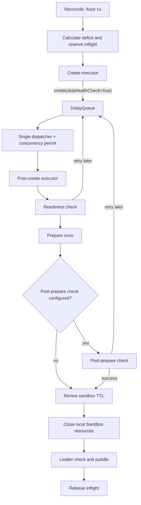

# OSEP-0021: Scalable Asynchronous Client-Side Pool Warmup

<!-- toc -->
- [Summary](#summary)
- [Motivation](#motivation)
  - [Relationship to OSEP-0005](#relationship-to-osep-0005)
  - [Goals](#goals)
  - [Non-Goals](#non-goals)
- [Requirements](#requirements)
- [Proposal](#proposal)
  - [Architecture overview](#architecture-overview)
  - [Public configuration](#public-configuration)
  - [Notes/Constraints/Caveats](#notesconstraintscaveats)
  - [Risks and Mitigations](#risks-and-mitigations)
- [Design Details](#design-details)
  - [1. Terminology and invariants](#1-terminology-and-invariants)
  - [2. Reconcile and create admission](#2-reconcile-and-create-admission)
  - [3. Per-pool execution resources](#3-per-pool-execution-resources)
  - [4. Warmup state machine](#4-warmup-state-machine)
  - [5. Delayed health checks and soft deadlines](#5-delayed-health-checks-and-soft-deadlines)
  - [6. Create retry and replenish backoff](#6-create-retry-and-replenish-backoff)
  - [7. Commit and capacity convergence](#7-commit-and-capacity-convergence)
  - [8. Leader tenure and shutdown](#8-leader-tenure-and-shutdown)
  - [9. PooledSandboxCreator contract](#9-pooledsandboxcreator-contract)
  - [10. Observability](#10-observability)
- [Test Plan](#test-plan)
- [Drawbacks](#drawbacks)
- [Alternatives](#alternatives)
- [Infrastructure Needed](#infrastructure-needed)
- [Upgrade & Migration Strategy](#upgrade--migration-strategy)
<!-- /toc -->

## Summary

This proposal replaces the Kotlin SDK client pool's thread-per-warmup execution
model with a staged asynchronous pipeline. Reconcile admits create requests at
a bounded per-pool rate, create runs in a dedicated elastic executor, delayed
health checks wait in a `DelayQueue`, and a second bounded executor advances
ready work through prepare, optional post-prepare validation, renew, and idle
commit.

The design decouples logical in-flight warmups from platform thread count while
preserving the client-side pool, acquire, sandbox TTL, and pluggable state-store
boundaries established by OSEP-0005.

## Motivation

The current Kotlin implementation binds one logical warmup slot to one platform
thread for the complete create/readiness/prepare/renew flow. A sandbox waiting
for its next readiness poll therefore consumes the same worker resource as a
sandbox actively running user preparation code.

Little's Law makes this coupling expensive at high throughput. For example, a
60-second end-to-end warmup at 100 completions per second requires approximately
6,000 logical in-flight tasks:

```text
logical in-flight = throughput × latency = 100/s × 60s = 6000
```

The logical concurrency is intrinsic to the latency target; 6,000 platform
threads are not. The pool needs a time-aware task model where delayed retries do
not occupy worker threads and where create pressure is controlled independently
from post-create execution concurrency.

The current model also couples several unrelated controls:

- `warmupConcurrency` limits both logical in-flight work and worker threads;
- reconcile completion can influence when more work is admitted;
- readiness polling sleeps inside workers;
- replenish failures activate exponential backoff even though a fixed create
  admission limit can provide the required pressure control.

### Relationship to OSEP-0005

OSEP-0005 remains the definition of the client-side pool, acquire semantics,
idle membership, leadership, and `PoolStateStore` contract. This proposal is a
follow-up that supersedes OSEP-0005 only for Kotlin SDK warmup scheduling,
replenish admission, warmup-related configuration defaults, and replenish
create backoff.

The following OSEP-0005 properties remain unchanged:

- an idle sandbox is borrowed at most once through atomic `tryTakeIdle`;
- acquired sandboxes are caller-owned and are not returned to the pool;
- `maxIdle` is a best-effort convergence target rather than a global hard cap;
- runtime quota and lifecycle services remain authoritative;
- state stores persist sandbox IDs and coordination metadata, not SDK objects;
- no lifecycle server API or runtime-side pooling feature is introduced.

### Goals

- Decouple logical warmup in-flight count from platform thread count.
- Bound warmup create admission with a clear per-pool QPS setting.
- Ensure health-check retry delays consume queue capacity but no worker thread.
- Preserve readiness before user preparation.
- Optionally validate sandbox health after preparation.
- Keep reconcile lightweight and independent from create batch completion.
- Preserve existing acquire, renew, resource cleanup, state-store, and shutdown
  behavior unless explicitly changed by this proposal.
- Define deterministic handling for failure, leader loss, cancellation, and
  health-check deadlines.

### Non-Goals

- Changing lifecycle server APIs or runtime scheduling.
- Redesigning Python, Go, JavaScript, or C# pool execution in this proposal.
- Introducing coroutines or virtual threads into the Kotlin SDK.
- Providing a process-wide executor, global QPS budget, or fairness across Pool
  instances.
- Providing a hard overall warmup deadline.
- Forcefully terminating arbitrary user preparer code.
- Making `maxIdle` a strongly consistent distributed capacity limit.
- Requiring a new atomic commit operation from third-party `PoolStateStore`
  implementations.

## Requirements

- Reconcile must remain leader-only for background maintenance.
- Reconcile must run on a fixed one-second schedule and must not wait for a
  create batch to complete.
- Every admitted create must reserve logical in-flight capacity before executor
  submission.
- Waiting for an initial health-check delay, polling interval, or final attempt
  must not consume a post-create worker.
- Pool warmup create must make at most one transport attempt per admission.
- Direct create, acquire fallback, standalone create, renew, and other lifecycle
  operations must retain their existing retry behavior.
- User preparation must execute at most once per sandbox.
- A sandbox must renew its server-side TTL immediately before it becomes idle,
  preserving the current warmup contract.
- Every task must release in-flight capacity and local resources exactly once.
- Existing third-party `PoolStateStore` implementations must remain usable
  without adding a new method.
- Existing `PooledSandboxCreator` signatures must remain source and binary
  compatible.

## Proposal

### Architecture overview



Each Pool owns its reconcile scheduler, create executor, delay queue,
dispatcher, post-create executor, and task registry. Configuration is expressed
per Pool, so resource ownership follows the same boundary.

### Public configuration

The Kotlin `PoolConfig` and `SandboxPool.Builder` surface changes as follows:

| Configuration | Change | Default | Meaning |
|---|---|---:|---|
| `warmupCreateQps` | Add, positive `Int` | `10` | Maximum warmup create admissions in each fixed one-second reconcile window |
| `warmupConcurrency` | Keep, change semantics and default | `128` | Maximum concurrent post-create workers |
| `warmupHealthCheckInitialDelay` | Add, non-negative `Duration` | zero | Delay from create completion to first readiness check |
| `warmupHealthCheckPollingInterval` | Keep, change Pool warmup default | `500ms` | Retry interval shared by readiness and post-prepare checks |
| `warmupReadyTimeout` | Keep | `30s` | Readiness-stage soft timeout |
| `warmupPostPrepareHealthCheck` | Add, nullable callback | `null` | Optional health check after the preparer succeeds |
| `warmupPostPrepareHealthCheckTimeout` | Add, positive `Duration` | `30s` | Independent post-prepare soft timeout |
| `reconcileInterval` | Remove | fixed internally to `1s` | No replacement configuration |

`warmupConcurrency` currently defaults to
`max(1, ceil(maxIdle × 0.2))`. The new fixed default prevents a large idle target
from implicitly creating the same number of platform threads.

The `500ms` polling default applies only to Pool warmup. Standalone create,
connect/resume, and Pool acquire retain their existing defaults.

No `warmupPrepareTimeout`, `warmupTotalTimeout`, post-prepare-specific polling
interval, create-concurrency setting, or jitter setting is added.

### Notes/Constraints/Caveats

- `warmupCreateQps` is an admission ceiling, not a throughput guarantee.
- One-second admission may produce a one-second request pulse. Millisecond-level
  traffic smoothing is not required.
- DelayQueue capacity is controlled logically through idle plus in-flight
  accounting; the JVM queue itself remains unbounded.
- Long-running preparers can occupy all post-create workers and delay health
  checks. The first implementation intentionally uses one shared budget.
- Multiple Pool instances in one JVM multiply their configured thread, request,
  connection, and memory budgets.
- The post-prepare check is disabled by default, preserving existing behavior.

### Risks and Mitigations

- **Create failure amplification without exponential backoff.** Mitigated by the
  fixed `warmupCreateQps` admission ceiling and by waiting for the next normal
  tick after every failure.
- **Worker starvation by long preparers.** Mitigated by a bounded shared worker
  pool, queue-delay metrics, and an explicit preparer contract requiring finite
  completion. Separate stage executors may be considered later if production
  evidence demonstrates starvation.
- **Large queues retain complete Sandbox objects and connections.** Mitigated by
  `maxIdle`/in-flight admission, prompt local close after renew, and required
  heap/socket/FD load testing.
- **Public behavior changes.** Mitigated by a compile-time failure for removed
  `reconcileInterval`, explicit migration guidance, and unchanged non-Pool call
  paths.
- **Temporary capacity overshoot during failover or resize.** Mitigated by local
  leader-tenure invalidation and existing excess-idle reconciliation. This is
  consistent with OSEP-0005's best-effort `maxIdle` contract.
- **Per-pool thread multiplication.** Mitigated by lazy elastic executors,
  30-second idle retirement, conservative defaults, and per-Pool metrics.

## Design Details

### 1. Terminology and invariants

- **Admission:** one reconcile decision authorizing one create request.
- **Inflight:** an admitted task that has not reached a terminal committed,
  discarded, or cancelled state.
- **Worker occupancy:** time spent actively executing readiness, prepare,
  post-prepare check, renew, commit, or cleanup. Time waiting in DelayQueue does
  not count.
- **Leader epoch:** a local monotonically increasing identity for one continuous
  tenure as Pool primary.
- **Soft deadline:** a stage deadline that still permits exactly one final check
  after the deadline when queue or worker delay prevented an earlier attempt.

Normal operation maintains:

```text
idle + inflight <= maxIdle
```

The invariant is an admission rule, not a strongly consistent distributed
transaction. Failover and concurrent resize may temporarily exceed the current
target and are repaired by excess-idle reconcile.

### 2. Reconcile and create admission

Reconcile runs every second. Create completion never triggers another tick.
Each tick reads local inflight before remote idle and calculates:

```text
inflightSnapshot = localInflight
idleSnapshot = stateStore.snapshotCounters(poolName).idleCount

toCreate = min(
    max(0, maxIdle - inflightSnapshot - idleSnapshot),
    warmupCreateQps,
)
```

The Pool reserves `toCreate` inflight leases before submitting any task. A
local executor rejection or create failure releases only that task's lease and
waits for the next fixed tick; it does not synchronously compensate.

When idle exceeds maxIdle, reconcile preserves OSEP-0005 shrink behavior:

```text
toRemove = min(idle - maxIdle, warmupConcurrency)
```

Reconcile removes those IDs from idle membership synchronously so they cannot
be acquired, then delegates remote kill to the post-create worker path. It does
not block the reconcile scheduler on lifecycle kill latency.

### 3. Per-pool execution resources

The create executor is elastic and has no work backlog:

```text
corePoolSize = 0
maximumPoolSize = ceil(warmupCreateQps × 1.5)
keepAliveTime = 30s
workQueue = SynchronousQueue
rejection = AbortPolicy
```

The 50 percent allowance absorbs create calls that cross the next one-second
tick. It does not authorize more requests in that tick.

The post-create executor is also elastic:

```text
corePoolSize = 0
maximumPoolSize = warmupConcurrency
keepAliveTime = 30s
workQueue = SynchronousQueue
rejection = AbortPolicy
```

A single dispatcher obtains a `Semaphore(warmupConcurrency)` permit before
calling `DelayQueue.take()`, then submits the due task directly. The worker
releases the permit in `finally`. Consequently, due tasks remain in DelayQueue
while all workers are active rather than migrating into a hidden unbounded
executor queue.

One dispatch may advance consecutive immediately executable stages. It returns
the task to DelayQueue only when a future due time is required; otherwise it
reaches a terminal state before releasing the permit.

### 4. Warmup state machine

```text
ADMITTED
→ CREATING
→ WAITING_READINESS
→ CHECKING_READINESS
→ PREPARING
→ WAITING_POST_CHECK       // optional
→ CHECKING_POST_PREPARE    // optional
→ RENEWING
→ CLOSING_LOCAL
→ COMMITTING
→ COMMITTED | DISCARDED | CANCELLED
```

Rules:

- Pool warmup create always requests `skipHealthCheck=true`.
- `warmupSkipHealthCheck=true` skips the Pool-managed readiness stage and its
  initial delay, but does not disable an explicitly configured post-prepare
  check.
- The preparer runs at most once.
- A post-prepare retry never reruns the preparer.
- After every configured check succeeds, the Pool executes
  `sandbox.renew(idleTimeout)` once, preserving current TTL semantics.
- After renew, the Pool stores the sandbox ID and closes the local Sandbox
  resources using the existing behavior before idle commit.
- A failed stage follows the existing best-effort remote kill and local close
  behavior.

Each task carries at least its task and sandbox IDs, complete Sandbox handle,
leader epoch, stage, stage deadline, due time, final-attempt flag,
preparer-executed flag, terminal state, inflight lease, trace context, and last
health-check error.

All terminal paths use compare-and-set ownership so metrics completion,
resource cleanup, and inflight release occur at most once.

### 5. Delayed health checks and soft deadlines

Readiness timing starts after create returns:

```text
readinessDeadline = createCompletedAt + warmupReadyTimeout
firstDue = min(
    createCompletedAt + warmupHealthCheckInitialDelay,
    readinessDeadline,
)
```

The Pool invokes the configured warmup health check or falls back to
`sandbox.ping()`. A false result or ordinary exception schedules the next
attempt from check completion time:

```text
nextDue = checkCompletedAt + warmupHealthCheckPollingInterval
```

After the preparer succeeds, the optional post-prepare stage starts with an
immediate first check:

```text
postPrepareDeadline = prepareCompletedAt + warmupPostPrepareHealthCheckTimeout
```

Both health stages use soft deadlines. If a normal next due time reaches the
deadline, the task is enqueued at the deadline with `finalAttempt=true`. If a
task is not executed until after its deadline because of queue or worker delay,
that execution is its final attempt. A successful final attempt advances the
state machine; false or exception discards the sandbox. Each stage executes at
most one post-deadline check.

Interruption, epoch invalidation, and shutdown are cancellation signals, not
ordinary health failures.

DelayQueue ordering and deadlines should use a monotonic clock. Wall-clock
timestamps are informative only.

### 6. Create retry and replenish backoff

Each Pool warmup admission maps to at most one lifecycle create transport
attempt. The Pool uses an internal create-only client/transport configured with
retry disabled, including OkHttp connection recovery. It retains the Pool's
authentication, headers, tracing, request timeout, and connection-pool
configuration.

This is compatible with OSEP-0017: callers still configure retry at the
`ConnectionConfig` client boundary, while Pool warmup constructs a distinct
internal single-attempt client for this non-idempotent background operation.
No general public per-request retry override is introduced.

The single-attempt rule applies only to Pool warmup create. It does not change:

- Pool acquire fallback/direct create;
- standalone `Sandbox.create`;
- connect, health check, prepare, renew, kill, or state-store operations.

HTTP 429, other HTTP errors, network failures, timeouts, and local rejections
all consume the current tick's admission and wait for the next tick after
releasing inflight.

Replenish create failures no longer suppress later ticks through exponential
backoff. Failure counters, last error, and `DEGRADED` may remain as observation;
`degradedThreshold` may continue to control that observed state, but it does not
change admission. Existing state-store retry policy is not changed by this
proposal.

### 7. Commit and capacity convergence

The success ordering is:

```text
validate leader epoch
→ renewPrimaryLock
→ putIdle
→ mark task committed
→ release inflight
```

Inflight must never be released before `putIdle`, because reconcile could then
observe a temporary capacity hole and over-admit. `putIdle` remains idempotent,
and a failed commit follows existing remove/kill cleanup before releasing the
lease.

This proposal does not add an atomic fenced-commit method to `PoolStateStore`.
The local epoch and pre-commit lock renewal reject normal stale completions. An
extreme pause between the final lock check and `putIdle` can still permit a
small temporary overshoot after another leader takes over. Concurrent resize
can similarly lower the target below already admitted work. Existing
excess-idle reconcile provides eventual convergence, consistent with
OSEP-0005's best-effort capacity model.

### 8. Leader tenure and shutdown

Each transition from non-leader to leader creates a new local epoch. Every task
admitted during that tenure carries the epoch. Definite lock loss invalidates
the epoch, stops new admission, removes queued tasks, and makes running task
results cleanup-only. Reacquiring leadership creates a new epoch even when the
configured owner ID is unchanged.

The Pool maintains an active-task registry by epoch. DelayQueue draining alone
is insufficient because it may omit not-yet-due and running tasks.

Shutdown retains existing public behavior:

- graceful shutdown stops reconcile and new admission, keeps the current
  heartbeat, and lets admitted tasks finish until `drainTimeout`;
- drain timeout or interruption invalidates the epoch and switches to forced
  cleanup;
- non-graceful shutdown invalidates immediately and forbids further commit.

Arbitrary preparer code is only interrupted on a best-effort basis. A preparer
that ignores interruption may continue running, but its eventual result cannot
re-enter the state machine after cancellation or epoch invalidation.

### 9. PooledSandboxCreator contract

The existing signature remains unchanged:

```kotlin
PooledSandboxCreator.create(PooledSandboxCreateContext): Sandbox
```

For `Reason.WARMUP`, the Pool always sets `skipHealthCheck=true`. The creator is
responsible for one create/connect operation and returns a Sandbox that has not
been declared ready by the Pool. The Pool owns readiness, prepare,
post-prepare validation, renew, and idle commit.

An existing custom creator that ignores `skipHealthCheck` remains callable, but
may perform duplicate readiness work and occupy the create executor longer.
Custom creators are expected to honor the single-attempt warmup-create
contract; the Pool cannot override retries implemented inside arbitrary user
code.

### 10. Observability

The staged pipeline uses traces and structured logs rather than adding a new
lifecycle metric event. It suppresses the legacy `sandbox.create` event because
the warmup create call only performs create/connect and is not an end-to-end
Pool success. Direct and standalone creates retain their existing metrics
behavior. No server metrics contract or ingestion change is required.

Tracing is opt-in through the existing `ConnectionConfig.enableTracing()`
setting and uses the application's global OpenTelemetry instance:

- one `pool.warmup` root starts at reconcile admission, before create-executor
  submission, and ends at the task's exactly-once terminal transition;
- create, prepare, renew, and commit are child spans;
- readiness and post-prepare readiness each emit one backdated summary span for
  the complete polling stage, not one span per health attempt;
- health summary spans record attempt count, false-result count, exception
  count, error category, and accumulated scheduler delay;
- synchronous stage exceptions are recorded on the failed child span. The root
  records the classified terminal stage, result, and reason without duplicating
  exception events;
- HTTP calls made while a warmup trace is current propagate W3C trace context.

Tracing and logs share one internal terminal vocabulary. Stages are `admission`,
`create`, `readiness`, `prepare`, `post_prepare_readiness`, `renew`, and
`commit`. Results are `success`, `failure`, `dropped`, and `cancelled`. Stable
reasons distinguish local create rejection, stage failures and health timeouts,
primary-lock loss, stale/retired runs, shutdown, interruption, and unexpected
failures.

Every warmup task has exactly one terminal outcome after winning its terminal
CAS. Success and expected cancellation use DEBUG. Failure and dropped outcomes
use WARN, rate-limited once per reason per Pool per 30 seconds; exact unsampled
result and reason counts remain in the periodic summary. Logs include pool,
sandbox when known, run generation, terminal stage/result/reason, duration, and
error category/details. Trace and span IDs are available through MDC while
tracing is enabled. Failures in the application's OpenTelemetry provider or
logging backend never prevent warmup cleanup or inflight release.

Error categories are transport-oriented and non-overlapping: `rate_limit`,
`http_4xx`, `http_5xx`, `http_other`, `timeout`, `connection`, `callback`, and
`state_store`. When the SDK cannot establish one of those causes it reports
`unclassified` rather than guessing from an exception message.

The current primary also emits a pool-level summary every 30 seconds when the
pool has in-flight warmup work or the interval contains events. An inactive Pool
does not emit idle heartbeat logs or query the state store solely for a summary.
This reuses the fixed reconcile
thread—no scheduler or worker is added. O(1) atomic counters track inflight tasks
by stage, admissions and terminal-result deltas, create/dispatch rejection,
executor utilization, queue size, and average health scheduler delay; the
summary never scans the `DelayQueue`. Stage and executor-active fields are
explicitly marked approximate, and the record declares eventual snapshot
consistency rather than implying a linearizable point-in-time view. Per-sandbox
IDs remain confined to traces and terminal logs.

The SDK uses the application's global OpenTelemetry sampler and exporter. It
does not force 100% sampling. Production deployments should choose a bounded
sampling policy appropriate for their warmup QPS; tracing-disabled and sampled
resource overhead are validated separately from functional E2E coverage.

## Test Plan

Unit and integration tests must cover:

1. Fixed one-second reconcile and absence of completion-triggered admission.
2. Deficit calculation and inflight reservation before executor submission.
3. Exactly-once inflight release across every terminal path.
4. Create executor sizing, local rejection, and no caller-runs fallback.
5. Warmup create single-attempt behavior without changing direct/standalone
   create retry.
6. DelayQueue initial delay, retry interval, monotonic ordering, and no busy
   loop.
7. Soft deadline and exactly one final attempt for both health stages.
8. Readiness before prepare, preparer at most once, and post-check retries that
   do not repeat prepare.
9. Sandbox renew and existing local close behavior before idle commit.
10. Dispatcher permit release on success, retry, exception, rejection, leader
    loss, and shutdown.
11. Concurrent completion, commit failure, resize overshoot, and eventual
    excess-idle shrink.
12. Leader loss, same-owner reacquisition with a new epoch, and delayed user
    callback completion.
13. Graceful and forced shutdown with creating, delayed, and running tasks.
14. Existing third-party `PoolStateStore` compatibility.
15. Existing and custom `PooledSandboxCreator` compatibility.
16. One trace per admitted warmup, one summary span per health stage, terminal
    OpenTelemetry status/reason classification, and trace-context propagation.
17. Exactly one terminal structured log per task and leader-only periodic pool
    summaries without a dedicated thread or `DelayQueue` scan.

Load tests should measure throughput, queue delay, heap retention, platform
threads, CPU, RSS, file descriptors, socket count, context switches, and
executor rejection under representative create and preparer latency
distributions. Default values are not capacity guarantees until validated.

## Drawbacks

- The Kotlin Pool gains a multi-stage task scheduler and more lifecycle state.
- More configuration is exposed to users.
- `reconcileInterval` removal is a source-breaking change.
- Fixed one-second admission deliberately permits request pulses.
- One shared post-create budget can allow long preparers to delay health checks.
- Disabling create retry may reduce realized replenish throughput during
  transient network failures.
- Per-pool executors can multiply process resources when many pools coexist.
- Best-effort capacity can temporarily overshoot during failover or resize.

## Alternatives

- **Keep one worker per complete warmup.** Rejected because logical delay and
  platform threads remain coupled.
- **Increase the existing fixed pool.** Rejected because it moves rather than
  removes the resource limit.
- **Use a normal FIFO queue.** Rejected because failed checks can be consumed
  again immediately and create a high-frequency loop.
- **Sleep inside worker threads.** Rejected because delayed tasks continue to
  consume platform threads.
- **Use one scheduled future per task.** Rejected in favor of a single ordered
  delay queue with explicit task ownership and shutdown behavior.
- **Use separate health and prepare executors.** Deferred; one shared budget is
  simpler and bounds aggregate post-create execution.
- **Use coroutines or virtual threads.** Deferred to avoid changing the Kotlin
  SDK execution/runtime baseline as part of this proposal.
- **Keep exponential replenish backoff.** Rejected because fixed create
  admission already bounds pressure and backoff obscures configured throughput.
- **Add strict atomic fenced commit to PoolStateStore.** Rejected for this phase
  to preserve third-party store compatibility and OSEP-0005's best-effort
  capacity model.
- **Millisecond-level token-bucket smoothing.** Rejected because one-second
  pulses are acceptable and the fixed reconcile clock is easier to reason
  about.

## Infrastructure Needed

No new server or mandatory datastore infrastructure is required. The Kotlin
SDK continues to use existing lifecycle APIs and `PoolStateStore` contracts.

A benchmark environment is recommended for validating defaults across create
latency, preparer latency, large logical in-flight counts, and shared versus
dedicated HTTP connection pools.

## Upgrade & Migration Strategy

This proposal intentionally includes one source-breaking change:

- Calls to `reconcileInterval(...)` no longer compile. Users remove the setting;
  reconcile is fixed at one second and no replacement is provided.

Other migration considerations:

- Unspecified `warmupConcurrency` changes from a maxIdle-derived value to 128.
  Users relying on the previous derived concurrency should configure an
  explicit value after capacity testing.
- Pool warmup polling defaults to 500ms instead of 200ms. Explicit existing
  values remain unchanged, and acquire/standalone defaults do not change.
- `warmupPostPrepareHealthCheck` defaults to null, so existing preparer behavior
  is preserved until users opt in.
- Existing `PooledSandboxCreator` and `PoolStateStore` interfaces do not gain a
  required method.
- Existing non-Pool APIs and direct-create retry behavior remain unchanged.

The implementation should land with release notes and Kotlin SDK migration
examples before the proposal advances to `implemented`.
