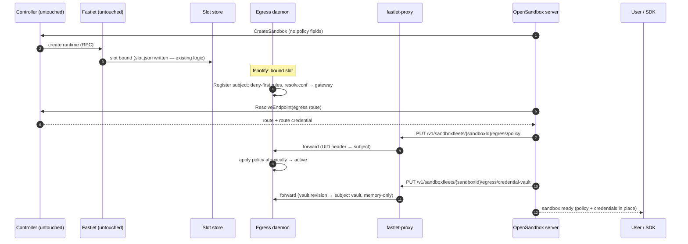
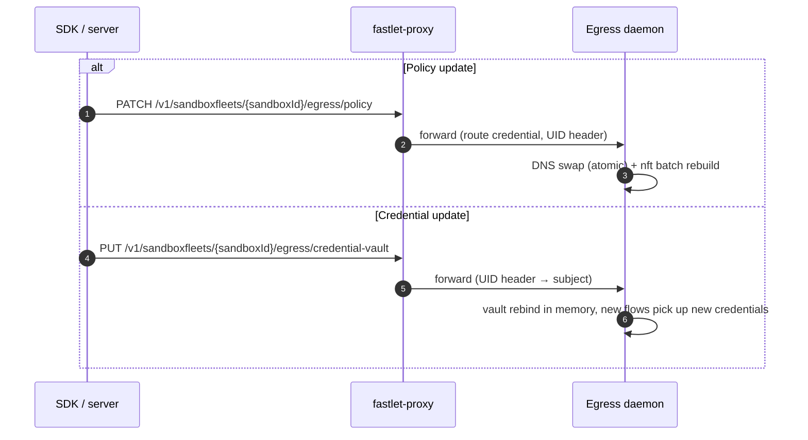

# OSEP-0022: Multi-Sandbox Egress Control Plane

<!-- toc -->
- [Summary](#summary)
- [Motivation](#motivation)
- [Goals and Non-Goals](#goals-and-non-goals)
- [Core Design](#core-design)
  - [Subject Abstraction](#subject-abstraction)
  - [Two Control Paths](#two-control-paths)
  - [Lifecycle and Fail-Closed Guarantee](#lifecycle-and-fail-closed-guarantee)
  - [Per-Subject Policy Consumption](#per-subject-policy-consumption)
  - [Sequences](#sequences)
- [System Boundaries](#system-boundaries)
  - [Profile Separation](#profile-separation)
  - [Security Boundaries](#security-boundaries)
  - [Platform Adapters](#platform-adapters)
  - [Scaling Constraints](#scaling-constraints)
- [Impact on fast-sandbox](#impact-on-fast-sandbox)
  - [Requirements on the Existing Implementation](#requirements-on-the-existing-implementation)
  - [Four Internal Additions](#four-internal-additions)
  - [Explicitly Untouched](#explicitly-untouched)
  - [OpenSandbox Server](#opensandbox-server)
- [Test Plan](#test-plan)
- [Drawbacks and Alternatives](#drawbacks-and-alternatives)
- [Infrastructure and Migration](#infrastructure-and-migration)
<!-- /toc -->

## Summary

A single egress control plane serves N sandboxes sharing one host/network domain (fast-sandbox Fastlet Pod, or bwrap isolated sessions). The existing single-sandbox sidecar profile is unchanged; `pod` profile adds a **Subject** abstraction — one opaque identifier per sandbox owning an isolated slice of policy, credentials, and kernel rules — dispatched by platform-provided identity keys. For fast-sandbox, the design deliberately avoids touching fast-sandbox's API: identity is observed from fastlet's existing network state store, and both policies and credentials are pushed by the server over fast-sandbox's own proxy-route mechanism (credentials stay memory-only in egress, consistent with OSEP-0012). A subject is fail-closed (deny-everything) from the moment it is observed until its policy lands, so "create-then-configure" can never be fail-open.

## Motivation

Egress today is a single sidecar sharing one netns with exactly one sandbox, relying on `CAP_NET_ADMIN` isolation (RFC [opensandbox-group/OpenSandbox#1582](https://github.com/opensandbox-group/OpenSandbox/issues/1582)). Two platform shapes break that model: fast-sandbox Fastlet Pods host N sandboxes with privileged guest roots (control plane must stay in the host domain), and bwrap sessions share the host netns with **no IP of their own** (source-IP dispatch impossible; host uid is the only key). Both need the same thing — *one control plane, many independent policy domains* — and the egress engines are already reusable (`pkg/nftables` has an injectable runner, `pkg/dnsproxy` a configurable listen address, `pkg/credentialvault` is in-memory); the missing piece is the policy-routing layer.

## Goals and Non-Goals

Goals:

1. **Subject abstraction**: platform-neutral identity as the unit of policy, credential, and rule ownership; dispatch key pluggable (source IP / host uid / cgroup path).
2. **Multi-sandbox dispatch**: one egress process hosts N independent subjects.
3. **Zero impact on single-sandbox mode**: sidecar profile, env, API, behavior unchanged when `pod` profile is off.
4. **Zero fast-sandbox API impact**: fast-sandbox CRD, RPC protocol, and fastlet process untouched; only four internal additions plus one deployment config.
5. **No new public contract**: `specs/egress-api.yaml` unchanged; no policy carrier (CRD/ConfigMap) introduced; no egress-local persistence.
6. **Engine reuse**: no behavioral changes inside `pkg/dnsproxy`, `pkg/nftables`, `pkg/credentialvault`, `pkg/mitmproxy`.

Non-Goals: no per-process policies; no eBPF; no in-guest control plane; no rate limiting; no DNS-protocol changes; no policy storage on the cluster.

## Core Design

### Subject Abstraction

```go
type Subject string                          // opaque, e.g. "s-<sandboxUID>"
type SubjectKey struct {                     // platform-provided identity material
    NetNSPath string; SourceIP netip.Addr    // fast-sandbox
    UID uint32                               // bwrap setpriv
    Cgroup string                            // bwrap userns (future)
}
type SubjectResolver interface { Resolve(key SubjectKey) (Subject, bool) } // hot path
type SubjectRegistry interface { List(); Get(); Register(); Update(); Unregister() }
type SubjectRuleBuilder interface { Predicates(subject Subject) (...) }    // cold path
```

Single-sandbox mode is the process being one implicit subject (no-op layer); `pod` profile is N subjects. The authority over "who is who" never belongs to egress — each adapter must prove its key unforgeable (IPAM + per-sandbox netns without `NET_ADMIN`; execd-assigned uid).

### Two Control Paths

`pod` profile has **no sandbox-reachable policy surface** (a fast-sandbox guest root is untrusted and must not rewrite its own policy). All policy/credential state flows over two disjoint paths, none involving fastlet code:

| Path | Direction | Auth | Carries |
|------|-----------|------|---------|
| **1. Proxy route** `/v1/sandboxfleets/{sandboxId}/egress/*` | server/SDK → fastlet-proxy → egress listener (`127.0.0.1:18080`, Pod netns) | Ed25519 route credential (proxy-verified) + `X-Fast-Sandbox-Uid` header added by proxy | Policy push and runtime policy/vault operations (existing `egress-api.yaml` semantics) — **including credential pushes** (`/credential-vault`), memory-only in egress |
| **2. Slot store** `/run/fast-sandbox/network/*.json` | fastlet writes (existing logic), egress observes read-only | shared volume | Subject lifecycle: identity, `SubjectKey`, fencing — **no policy, no credentials** |

The listener binds `127.0.0.1:18080` (Pod netns loopback) — sandbox netns cannot reach it, so the proxy is the only peer; egress rejects unknown UIDs (404). Credentials are delivered by the server as complete vault revisions over the proxy route, consistent with OSEP-0012 (no Kubernetes Secret, no kubelet sync dependency). There is no unix socket, no Secret volume, and no egress-managed state file.

#### Consumed slot fields

Egress reads exactly these fields from a bound slot record (everything else in the slot is ignored):

| Field | Used for |
|-------|----------|
| `id`, `phase` (`Bound`) | lifecycle trigger; clean/destroying slots ignored |
| `owner.sandboxUid`, `owner.instanceGeneration`, `owner.assignmentAttempt` | Subject identity + fencing |
| `ip` | dispatch key (`ip saddr`) |
| `hostNetnsPath` | netns path for rule installation / defense-in-depth |
| `hostVeth` | `iifname` binding against UDP spoofing |
| `gateway` | DNS proxy bind target / resolv.conf rewrite |
| `privateCidr` | sibling-isolation / defense-in-depth rules |
| `dnsPath` | resolv.conf rewrite target file |

**Contract status — open question**: this data currently comes from fastlet's **internal** file store (`FileStateStore`, `/run/fast-sandbox/network/*.json`): the path, JSON shape, and phase semantics are implementation details, not a public contract. Three drift risks follow: format changes (the slot `version` field is fastlet-internal — a mismatch triggers destruction, not compatibility), path/storage changes, and phase-semantics changes. Two stabilization options, pending fast-sandbox's decision:

1. **File contract** (minimal): fast-sandbox declares the slot-store format/path/lifecycle as a supported v1 contract for host-domain consumers.
2. **kubelet-style read-only endpoint** (recommended analogy): fastlet already serves an HTTP RPC server to the controller (`internal/fastlet/server/rpc_server.go`); adding a read-only slot-list endpoint (with fencing, watch support) makes the data a stable component API, decoupled from the storage medium. Cost: one small handler in fastlet, trading the "zero fastlet code" property for a real stability guarantee.

### Lifecycle and Fail-Closed Guarantee

```
   slot Bound appears          policy arrives         steady
absent ────────────► denying ────────────────► active ────► …
    ▲                    │ deny-first             │
    └──── slot file deleted ◄─────────────────────┘
```

- **Register** on observing a bound slot (identity + fencing from `Owner`); **denying** state installs deny-first rules immediately (nft sets empty, resolv.conf → gateway, REDIRECT + forward rules) — the subject is fully blocked until policy lands.
- **Update** on policy push (proxy route): DNS policy swap + one atomic nft batch (delete+add in a single `nft -f` transaction). Credential updates are pushed the same way (`/credential-vault`), memory-only.
- **Unload** on slot-file deletion (fastlet's existing release path): detach → deny → free.
- **Race handling**: a push for an unknown UID is cached as pending (with TTL) until the slot appears; both sides idempotent. Fencing mismatch (same UID, new generation) discards old state — a reset can never carry old policy into a new sandbox.
- **Recovery**: egress restart → rescan slot store, every live subject re-enters `denying`; server reconciliation re-pushes policies. No platform replay, no fastlet involvement.

### Per-Subject Policy Consumption

```
 SubjectRegistry:  s-A→policy/vault/sets   s-B→policy/vault/sets   s-C→…
        │                │                       │
   SubjectResolver (hot path: source IP → Subject)
        │                │                       │
   DNS proxy         nft builder             mitmdump (SHARED)
   per-query policy  per-subject sets        vault by client source IP
   (w.RemoteAddr)    (deny-first)            (REDIRECT preserves source IP)
        └── resolved IPs ──► dynamic allow sets (per subject)
```

Each subject owns an isolated slice (policy, vault, kernel sets); the resolver is the only shared component (pure map lookup). The mitmdump instance is shared in the fast-sandbox adapter; per-subject listeners are only needed where identity is not recoverable from the socket (bwrap uid mode).

### Sequences

#### Sandbox creation: policy + credential initialization



Invariant: the subject is enforced from the moment the slot is observed — the push can be late, never early-open.

#### Runtime updates



Unload is purely observational: sandbox deletion → slot file disappears → Unload. No lifecycle verb exists on any channel.

## System Boundaries

### Profile Separation

The two profiles are mutually exclusive deployment forms. `sidecar`: a service inside the sandbox network domain owning the public contract (18080, `/policy`, `/credential-vault`) — unchanged. `pod`: a host-domain control-plane component — identity from slot store, policies and credentials pushed by the server over the proxy route.

### Security Boundaries

| Boundary | Guarantee |
|----------|-----------|
| No sandbox-reachable policy surface | Listener on Pod-netns loopback only; sandbox guests cannot reach it; UID header trust relies on the proxy being the only peer |
| Control plane outside the sandbox | Egress daemon never runs in the guest (RFC #1582 trust-boundary analysis); sandbox users run privileged and cannot touch it |
| Credentials memory-only | Complete vault revisions are pushed over the proxy route (OSEP-0012 model) and held in egress memory; never written to egress disk; no per-subject secret reuse (breach scoping). Transport note: the proxy route is Pod-network HTTP — the same trust domain the existing route-credential mechanism already assumes |
| Fail-closed at every transition | `denying` state, atomic policy swaps, deny-first registration |
| Management plane independent of subject state | While a subject is `denying` (or `active`), policy pushes and runtime policy/vault operations remain fully usable: the proxy route terminates in the host domain (Pod-netns loopback) and never traverses sandbox traffic paths — only application traffic is blocked (DNS NXDOMAIN + forward drop) |
| No creation window when egress is unavailable | The OpenSandbox runtime driver probes egress healthz (`127.0.0.1:18080/healthz`, same Pod netns) inside `EnsureSandbox` before creating the sandbox container; unready egress rejects creation. The normal path has no window anyway (slot `Bound` is written by `Acquire` before the container is created, and deny-first installation is far faster than container startup); a fully deterministic guarantee (independent of timing) would additionally require the driver to confirm the subject is registered before container creation — recorded as a known trade-off |
| Dispatch key unforgeability | IPAM + per-sandbox netns without `NET_ADMIN` (existing); the new OpenSandbox driver additionally drops `NET_RAW`; `iifname` binding remains as defense in depth |
| Enforcement placement | Pod netns `hook forward` (MASQUERADE happens at POSTROUTING, source IP intact); per-sandbox netns OUTPUT installed from host (defense in depth, `linux_driver.go` precedent); Kata covered via TAP (same forward surface) |

### Platform Adapters

| Concern | fast-sandbox | bwrap (setpriv) |
|---------|-------------|-----------------|
| SubjectKey | netns + source IP | host uid |
| Enforcement hook | Pod netns `hook forward` + per-sandbox netns OUTPUT | host netns `hook output` |
| DNS | proxy on `<gateway>:53`, resolv.conf rewritten | per-subject port REDIRECT `-m owner --uid-owner` (port = subject) |
| MITM | shared mitmdump, vault by client IP | per-subject ports |
| Lifecycle authority | fastlet slot store (read-only) | execd session registry, same watch pattern |
| Credentials | proxy-route vault endpoints (OSEP-0012 model) | proxy-route vault endpoints |
| Endpoint | `/v1/sandboxfleets/{sandboxId}/egress/*` via `ResolveEndpoint` (host delivery mode) | TBD (execd adapter to be detailed separately) |

### Scaling Constraints

Two scales matter independently. **Cluster-wide** there is no centralized bottleneck: policy and credentials are pushed point-to-point per Fastlet Pod, identity observed from per-Pod slot stores — no watch storm, no etcd write amplification, no API-server dependency in the control path (decisive argument against a CRD/ConfigMap policy carrier). **Per-Pod density** (target 64 subjects/Pod, ≤100 policy updates/s/Pod): nft dispatch is O(1) with incremental per-subject set updates; the connection-refresh loop must be bucketed per subject; one shared mitmdump; DNS proxy is a stateless map lookup; watch inotify count limits (default 8192) on shared hosts with polling fallback. Server orchestration must be idempotent — a failed push leaves the subject `denying` (safe) and the server retries before marking the sandbox usable.

## Impact on fast-sandbox

### Requirements on the Existing Implementation

Verified against current source (`internal/runtime/containerd/driver.go`):

| Requirement | Status | Notes |
|------------|--------|-------|
| Per-sandbox slot store (`Owner`, IP, netns, veth; Bound/delete lifecycle) | ✅ already present | consumed read-only by egress |
| Slot pre-provisioning: netns/veth/MASQUERADE ready before sandbox creation; `Acquire` writes Bound before the container is created | ✅ already present | basis of the no-creation-window guarantee |
| Sandbox without `NET_ADMIN` (dispatch key unforgeable) | ✅ already present | spec sets no capabilities (`driver.go:438`); runc defaults exclude `NET_ADMIN` |
| resolv.conf bind-mount from slot `DNSPath` | ✅ already present | rewritten by egress before the mount happens |
| Route-credential issuance/verification + fastlet-proxy in Pod netns | ✅ already present | reused as-is |
| Egress container mountable via `FastletTemplate` (shared volumes) | ✅ deployment-level | no code change |

### Four Internal Additions

Verified against current source; all are internal, no API/CRD/protocol changes:

1. **Host delivery mode** in the infra catalog (`InfraDeliveryMode`, e.g. `host-process`, alongside bind-mount/image-layer/guest-copy, `internal/catalog/runtime/catalog.go:36-43`): compiled into the Pool revision but excluded from the in-sandbox `sandbox-init` supervisor config; the daemon is provisioned by `FastletTemplate`; readiness probing targets the Pod-netns listener instead of the sandbox IP.
2. **Host upstream in fastlet-proxy**: the proxy currently forwards to the sandbox `Access` address only (DirectIP/LocalForward, `internal/dataplane/fastletproxy/proxy.go:101-133`). The egress route must forward to the Pod-netns listener (`127.0.0.1:18080`) instead.
3. **UID propagation**: the proxy rewrites outbound paths to the suffix only (`proxy.go:140`), so it must inject `X-Fast-Sandbox-Uid` (outside `stripRouteHeaders`) — this is what answers "which subject".
4. **Route parsing**: `parseTarget` currently recognizes only `/v1/sandboxes/` (ports) and `/v2/sandboxes/` (components) prefixes (`proxy.go:164-171`); it gains a `/v1/sandboxfleets/{sandboxId}/egress/*` branch that resolves the sandbox route, verifies the credential, and targets egress — independent of the component `Components` map. The credential's target semantics in this branch must match what `ResolveEndpoint` issues for the egress target (component-target `egress`, or a dedicated sandboxfleets target — both sides must agree).

Deployment config: egress container in Pool `FastletTemplate` (Pod-netns privileges; slot-store and netns-mount volumes shared/mounted).

**OpenSandbox runtime driver**: the OpenSandbox integration lands as a **new `internal/runtime/contract.Driver` implementation** (registered in the runtime factory alongside containerd/boxlite). Its container spec drops `NET_RAW` (runc defaults grant it → UDP source spoofing would weaken the source-IP dispatch key; `iifname` binding in nft remains as defense in depth). The egress healthz probe lives inside its `EnsureSandbox` (after slot `Acquire`, before container creation): unready egress → reject with a runtime-unavailable error. Existing drivers are untouched; existing Fastlet Pods without the egress component behave exactly as today.

### Explicitly Untouched

fast-sandbox CRDs, RPC protocol, `SandboxSpec`, fastlet phases/admission/deletion paths, the data-plane reconcile loop, route-credential issuance/verification, `sandbox-init` supervisor, and the existing containerd/boxlite runtime drivers. `specs/egress-api.yaml` and SDKs unchanged. The server's K8s-mode egress sidecar helper (`egress_helper.py`) is untouched.

### OpenSandbox Server

- Fleets mapping removes the phase-1a rejection of `networkPolicy`/`credentialProxy` (`services/fleets/create_mapping.py:253,263`) and orchestrates create-then-configure (policy push + credential-vault push) with idempotent retries.
- Endpoint reuse: `fastpath_client.resolve_endpoint(...)` for the egress target; the returned proxy route uses the `/v1/sandboxfleets/{sandboxId}/egress/*` prefix. Route-credential issuance and proxy verification unchanged.
- Egress readiness surfaced via the platform's `InfraComponentStatus` channel (optional, non-blocking).

## Test Plan

- Unit: subject registry transitions and fail-closed invariants; rule-builder determinism; dispatch (DNS per-subject, nft sets, mitm vault selection).
- fast-sandbox e2e (Kind): N sandboxes with distinct policies on one Fastlet Pod; per-subject allow/deny at DNS/nft; sibling isolation; fail-closed create-then-configure window (including push racing slot observation); credential-vault push binds the right subject and rebinds on update; restart recovery (rescan → `denying` → server re-push → active, no stale rules); sandbox cannot reach any policy-mutation surface; UID-header forgery rejected.
- bwrap: per-uid dispatch with host-uid allowlist intact. Kata: policy enforced via the Pod netns forward hook.
- Compatibility: full egress suite in `sidecar` profile; `test_egress_helper.py` unchanged.
- Manual: kill mid-transition; restart storm; failed push leaves subject `denying`, retry succeeds.

## Drawbacks and Alternatives

Drawbacks: a Pod-domain daemon is a larger trust domain than per-sandbox processes (mitigated by per-subject isolation + deny-first); create-then-configure changes provisioning semantics (usable only after push succeeds); policy has no cluster-side record, so the server must keep its own state and reconcile after restart.

Alternatives considered: per-subject host-side processes (kept as deployment variant); per-sandbox sidecar in the guest netns (rejected — control plane inside the trust boundary it controls is not a security control); eBPF/cgroup dispatch (deferred); policy carrier via CRD/ConfigMap (rejected — semantic mismatch, etcd write amplification, watch storms, credential exposure, and it couples a generic component to the cluster API); credentials via a host-domain unix socket or Kubernetes Secret volume (replaced by direct vault-API pushes over the proxy route, consistent with OSEP-0012).

## Infrastructure and Migration

- fast-sandbox: no new repos, no API changes — the four internal additions above plus deployment config. Cross-repo dependency: import `egress/pkg/...` as a Go module (replace directive) or extract `pkg/subject` plus engines into a shared module.
- `sidecar` is the default profile; existing deployments upgrade with zero config change. `pod` profile is opt-in (`OPENSANDBOX_EGRESS_PROFILE=pod`); Fastlet Pods without the egress component behave exactly as today until an operator enables it. Rollout order: fast-sandbox internal additions (inert) → egress `pod` profile behind a feature gate → server fleets mapping + orchestration.
